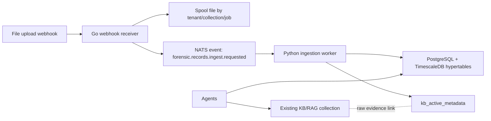

# Forensic Intelligence Platform - Phase 1

Phase 1 introduces an enterprise ingestion path for structured forensic telemetry. It is additive to the existing LocalAI Knowledge Base and the current lightweight Records UI.

## Architecture Decision

The existing Knowledge Base remains the RAG/evidence layer. It is good for source lookup, semantic retrieval, and contextual grounding, but it is not sufficient for exact analytical questions over millions of rows.

The enterprise Records pipeline adds a deterministic structured store:



Use this mental model:

- **Knowledge Base/RAG**: finds evidence and context.
- **Records/TimescaleDB**: computes exact facts.
- **Agents**: decide which tool to use and synthesize cited answers.

## Reference CDR Schema

The attached `923461678183.csv` sample has 3,931 data rows and these columns:

- `MSISDN`
- `call_org_num`
- `CALL_DIALED_NUM`
- `IMSI`
- `IMEI`
- `CALL_START_DT_TM`
- `CALL_END_DT_TM`
- `INBOUND_OUTBOUND_IND`
- `Call_Network_Volume`
- `Lac_Id`
- `Site_Id`
- `Cell_SITE_ID`
- `lat`
- `longitude`
- `CALL_TYPE`
- `location`

Validated profile:

- Rows: `3931`
- Timestamp range: `2026-04-02 01:22:34` to `2026-06-20 19:08:01`
- Call types: `GPRS=3410`, `SMS=341`, `VOLTE=140`, `CALL=40`
- Directions: `DATA=3410`, `INCOMING=404`, `OUTGOING=117`
- Unique targets: `37`
- Unique locations: `34`
- Exact duplicate raw rows: `297`

## Phase 1 Components

| Path | Purpose |
| --- | --- |
| `db/forensic_records/001_phase1_records.sql` | TimescaleDB schema, hypertable, indexes, RLS, metadata, audit tables |
| `db/forensic_records/003_phase2_kb_assets_and_entities.sql` | KB asset registry, generic structured records table, cross-record entity index |
| `api/forensic_records/` | Go webhook receiver; streams upload to spool; publishes NATS job |
| `ingestion/forensic_records/` | Python worker; validates schema; routes adapters; streams rows through PostgreSQL `COPY` |
| `docker-compose.forensic-records.yaml` | Local Phase 1 stack: TimescaleDB, NATS, webhook API, worker |

The compose stack includes a one-shot `forensic-spool-init` service. It prepares the shared spool volume for the non-root API and worker containers, so uploads can be written safely without running long-lived services as root.

## Running Phase 1 Locally

Start the enterprise ingestion stack:

```powershell
docker compose -f docker-compose.forensic-records.yaml up --build
```

By default the forensic webhook also tries to mirror uploaded files into the existing LocalAI Knowledge Base endpoint at `http://host.docker.internal:8080`. If LocalAI auth is enabled, set `LOCALAI_API_KEY` before starting compose:

```powershell
$env:LOCALAI_API_KEY="your-localai-api-key"
docker compose -f docker-compose.forensic-records.yaml up --build -d
```

If you want to test structured ingestion without KB mirroring, set `FORENSIC_KB_MIRROR_ENABLED=false` in `docker-compose.forensic-records.yaml`.

Upload the attached CDR sample:

```powershell
curl.exe -X POST http://localhost:8091/webhooks/records/upload `
  -F "tenant_id=default" `
  -F "collection_id=records-demo" `
  -F "record_type=cdr" `
  -F "file=@C:\Users\W S Mughal\Downloads\923461678183.csv"
```

Uploads are idempotent by default. If the same SHA-256 already exists in the same tenant/collection, the webhook returns `status=duplicate` and does not queue another batch. Use `-F "force=true"` only when a deliberate duplicate batch is required for testing.

Check metadata:

```powershell
docker compose -f docker-compose.forensic-records.yaml exec forensic-postgres `
  psql -U localrecall -d localrecall `
  -c "SELECT status, source_file, total_rows, accepted_rows, duplicate_rows, rejected_rows FROM forensic.records_ingest_jobs ORDER BY queued_at DESC LIMIT 5;"
```

Check Knowledge Base active metadata:

```powershell
docker compose -f docker-compose.forensic-records.yaml exec forensic-postgres `
  psql -U localrecall -d localrecall `
  -c "SET app.tenant_id='default'; SELECT collection_id, source_file, total_rows, inserted_rows, duplicate_rows, unique_targets_count, min_timestamp, max_timestamp FROM forensic.kb_active_metadata;"
```

Run an exact analytical query:

```powershell
docker compose -f docker-compose.forensic-records.yaml exec forensic-postgres `
  psql -U localrecall -d localrecall `
  -c "SET app.tenant_id='default'; SELECT dialed_number, total_interactions, incoming_count, outgoing_count FROM forensic.cdr_frequent_contacts ORDER BY total_interactions DESC LIMIT 10;"
```

## Accuracy Rules

- Exact counts, rankings, filters, min/max, correlations, and timelines must query structured tables.
- KB/RAG must be used for raw evidence, source lookup, and explanations.
- Agents should never answer exact analytics from retrieved KB chunks alone.

## Phase Approval Gate

Phase 1 is complete when:

- The webhook returns `202 Accepted`.
- The worker writes `completed` job status.
- `forensic.cdr_records` contains parsed rows.
- `forensic.kb_active_metadata` matches the sample profile.
- Query outputs match deterministic sample expectations.

Do not proceed to Phase 2 until Phase 1 is approved.

## Hybrid KB + Records Policy

This policy applies to all current and future record types: CDR, ANPR, IPDR, subscribers, tower locations, transactions, access logs, policy documents, case files, and generic records.

The feature should be presented as a Knowledge Base capability, with Records as the deterministic analytical execution layer behind the KB. In product terms, analysts upload everything into a KB collection; internally, unstructured files become searchable chunks and structured files are additionally normalized into typed analytical stores.

| Question type | Correct system |
| --- | --- |
| Source lookup, evidence search, summaries, policy explanations | Knowledge Base / RAG |
| Counts, filters, min/max, top N, timelines, joins, correlations | Records / SQL analytics |
| Final narrative, recommendations, analyst report | Agent using both KB and Records |

Agents must follow these routing rules:

1. If the user asks for an exact value, use Records or SQL first.
2. If the user asks for evidence, source text, policy language, or explanation, use KB/RAG.
3. If the user asks for an exact answer with proof, compute with Records and cite KB/source metadata.
4. Never infer exact totals from retrieved KB chunks.
5. Never send full raw tables to the LLM. Send only aggregated JSON, selected rows, and citations.

Future record families should be added through typed adapters:

| Record family | Key entities | Primary analytics |
| --- | --- | --- |
| CDR | MSISDN, IMSI, IMEI, cell, location | contacts, durations, movement, anomalies |
| IPDR | MSISDN, IP, port, session time | internet sessions, IP correlation |
| ANPR | plate, camera, location, timestamp | sightings, repeat routes, co-location |
| Subscriber | MSISDN, CNIC/customer, IMSI | identity lookup, ownership history |
| Tower/location | cell ID, latitude, longitude | movement, base location, tower joins |
| Transaction | account, counterparty, amount | flows, top counterparties, suspicious timing |
| Access log | IP, user, path, status | authentication/session anomalies |
| Policy/case docs | document section, clause, subject | semantic retrieval and cited summaries |

## Phase 2 KB-Centered Routing

Phase 2 makes the Knowledge Base collection the analyst-facing boundary. Every upload has a `collection_id`; the system then classifies the file and chooses the right internal execution path.

| File family | KB/RAG behavior | Structured behavior |
| --- | --- | --- |
| PDF, docs, policies, notes | chunk, embed, cite | optional metadata only |
| CDR | keep source evidence link | typed CDR hypertable + entity index |
| IPDR | keep source evidence link | generic records + IP/session entities |
| ANPR | keep source evidence link | generic records + plate/camera entities |
| Subscriber/tower/transaction/access logs | keep source evidence link | generic records + extracted entities |
| Unknown CSV/TSV | keep source evidence link | generic records with best-effort canonical fields |

The worker now has an adapter registry:

- `cdr`
- `ipdr`
- `anpr`
- `subscriber`
- `tower_location`
- `transaction`
- `access_log`
- `generic`

Every structured upload writes:

- `forensic.kb_collection_assets`: KB-facing source asset, routing decision, source hash, headers, quality report.
- `forensic.kb_active_metadata`: analytical summary for the batch.
- `forensic.cdr_records`: exact CDR analytics when the adapter is `cdr`.
- `forensic.generic_records`: exact row-preserving storage for other structured families.
- `forensic.record_entities`: normalized entity index for phone, IMSI, IMEI, cell, plate, IP, location, account, user, or generic primary/secondary entities.

Apply Phase 2 to an existing local database:

```powershell
docker compose -f docker-compose.forensic-records.yaml exec forensic-postgres `
  psql -U localrecall -d localrecall `
  -f /docker-entrypoint-initdb.d/003_phase2_kb_assets_and_entities.sql
```

Rebuild the Phase 2 API and worker:

```powershell
docker compose -f docker-compose.forensic-records.yaml up --build -d forensic-records-api forensic-records-worker
```

Check KB asset routing:

```powershell
docker compose -f docker-compose.forensic-records.yaml exec forensic-postgres `
  psql -U localrecall -d localrecall `
  -c "SELECT collection_id, source_file, detected_record_type, structured_status, rag_status, routing_decision FROM forensic.kb_collection_assets ORDER BY created_at DESC LIMIT 5;"
```

`rag_status` meanings:

- `mirrored`: raw file was uploaded into the existing LocalAI KB collection and is available for RAG search.
- `failed`: structured ingest can still complete, but KB upload failed; inspect `records_ingest_jobs.metadata`.
- `skipped`: KB mirroring was disabled.
- `pending`: reserved for future asynchronous KB mirroring.

Check cross-record entities:

```powershell
docker compose -f docker-compose.forensic-records.yaml exec forensic-postgres `
  psql -U localrecall -d localrecall `
  -c "SELECT entity_type, entity_value, observation_count, record_types FROM forensic.entity_activity_summary ORDER BY observation_count DESC LIMIT 20;"
```

## Phase 3 Hybrid Query Router

The forensic API exposes a safe hybrid query gateway:

- `GET /query/templates`: lists supported analytical and evidence templates.
- `POST /query/hybrid`: routes a question to Records SQL, KB evidence, or both.

The router intentionally does not execute arbitrary LLM-generated SQL. It uses rule-based intent classification plus hardcoded, parameterized, read-only SQL templates for exact analytics. This protects the zero-hallucination contract: exact counts and timelines come from TimescaleDB; KB text is used for evidence and context.

Supported templates:

| Template | Purpose |
| --- | --- |
| `collection_overview` | Collection ingest, KB asset, and record-family overview |
| `frequent_contacts` | CDR frequent contacts matrix with incoming/outgoing ratio and first/last contact |
| `call_type_breakdown` | CDR event counts by call type and direction |
| `temporal_activity` | Hourly activity, nocturnal events, and non-zero duration statistics |
| `top_locations` | Most frequent CDR locations and cell sites |
| `geospatial_movement` | Chronological movement and off-peak base-location candidates |
| `anpr_sightings` | ANPR sightings by plate, camera, and location |
| `entity_activity` | Cross-record entity summary across CDR, ANPR, IPDR, and generic uploads |
| `relationship_network` | Co-observed entities that appear in the same rows as a target |
| `entity_timeline` | Chronological timeline across CDR and generic record families |
| `source_records` | Small capped set of matching source rows for audit review |
| `schema_profile` | Detected headers, normalized schemas, routing status, and quality reports |
| `data_quality` | Ingest quality, duplicate counts, rejected rows, and parser error samples |
| `evidence` | KB evidence search with raw-entry fallback |

The `template` field is optional. For raw analyst questions, the router extracts likely targets and maps the question to the safest supported template:

| Raw question | Planned template |
| --- | --- |
| `show collection status and duplicate rows` | `collection_overview` |
| `how many GPRS records are there` | `call_type_breakdown` |
| `show top locations for 923461678183` | `top_locations` |
| `where was ABC-123 seen` | `anpr_sightings` |
| `summarize evidence for ABC-123 and show related entities` | `entity_activity` + KB evidence |
| `show relationship network for ABC-123` | `relationship_network` |
| `build timeline for ABC-123` | `entity_timeline` |
| `show source rows for ABC-123` | `source_records` |
| `show detected headers and schema` | `schema_profile` |
| `show duplicate and rejected row quality` | `data_quality` |

Example frequent contacts query:

```powershell
$body = @{
  tenant_id = "default"
  collection_id = "records-demo"
  query = "show frequent contacts"
  template = "frequent_contacts"
  limit = 10
} | ConvertTo-Json -Compress

Invoke-RestMethod -Uri "http://localhost:8091/query/hybrid" `
  -Method Post `
  -ContentType "application/json" `
  -Body $body
```

Example hybrid evidence + entity query:

```powershell
$body = @{
  tenant_id = "default"
  collection_id = "records-demo"
  query = "summarize evidence for ABC-123 and show related entities"
  target = "ABC-123"
  limit = 10
  max_kb_results = 1
} | ConvertTo-Json -Compress

Invoke-RestMethod -Uri "http://localhost:8091/query/hybrid" `
  -Method Post `
  -ContentType "application/json" `
  -Body $body
```

If the current LocalAI KB vector search cannot search a mirrored CSV, the endpoint falls back to raw KB entry content and returns a warning instead of failing the whole investigation query. This preserves KB connectivity while keeping exact analytics on the structured Records path.

Example raw runtime query with no explicit template:

```powershell
$body = @{
  tenant_id = "default"
  collection_id = "records-demo"
  query = "where was ABC-123 seen"
  limit = 10
} | ConvertTo-Json -Compress

Invoke-RestMethod -Uri "http://localhost:8091/query/hybrid" `
  -Method Post `
  -ContentType "application/json" `
  -Body $body
```

## Phase 4 Deterministic Report Synthesis

The forensic API exposes:

- `POST /reports/generate`

This produces a Markdown investigation report from the same safe templates used by the hybrid query router. It is intentionally deterministic: the report contains computed aggregates, source previews, warnings, and guardrails, but no unsupported narrative claims.

Example:

```powershell
$body = @{
  tenant_id = "default"
  collection_id = "records-demo"
  target = "ABC-123"
  include_evidence = $true
} | ConvertTo-Json -Compress

Invoke-RestMethod -Uri "http://localhost:8091/reports/generate" `
  -Method Post `
  -ContentType "application/json" `
  -Body $body
```

Report sections:

- Execution header
- Executive brief
- Collection overview
- Record-family summary
- Frequent contacts
- Temporal activity
- Top locations
- Entity activity
- ANPR sightings
- Knowledge Base evidence
- Warnings

## Phase 5 Agent Tool Bridge

Agents can now use the enterprise forensic sidecar as a governed Knowledge Base capability instead of guessing from retrieved text. When enabled on an agent, LocalAI injects three read-only tools:

| Tool | Purpose |
| --- | --- |
| `forensic_query_templates` | Lists deterministic query templates and their records/KB route |
| `forensic_hybrid_query` | Routes analyst questions to exact Records SQL, KB evidence, or both |
| `forensic_generate_report` | Builds a deterministic Markdown case report from exact aggregates and KB source previews |

Agent routing rules:

1. Use `forensic_hybrid_query` for natural-language analyst questions such as `show relationship network for ABC-123`, `show duplicate and rejected row quality`, or `summarize evidence for ABC-123 and show related entities`.
2. Use `forensic_query_templates` when the agent is unsure which deterministic capability exists.
3. Use `forensic_generate_report` when the analyst asks for a case brief, report, or handoff summary.
4. Use `search_memory` / KB search for policy language, free-text context, and evidence previews.
5. Preserve forensic API warnings in the answer, especially KB vector fallback warnings.

Agent UI configuration:

1. Open `Build` -> `Agents`.
2. Create or edit an agent.
3. Enable `Knowledge Base`.
4. Enable `Forensic Records`.
5. Set `Forensic Records API URL` to the sidecar URL:

```text
http://host.docker.internal:8091
```

Use `http://localhost:8091` only when the agent process runs directly on the host rather than inside a Docker container.

6. Set `Forensic Tenant ID` to `default`.
7. Set `Forensic Collection ID` to the KB collection/case, for example `records-demo`.
8. Increase `Max Iterations` to at least `2` so the agent can call a tool and then synthesize the answer.

Environment fallback:

```powershell
$env:FORENSIC_RECORDS_API_URL="http://host.docker.internal:8091"
```

If LocalAI auth is enabled on the sidecar bridge, also set:

```powershell
$env:FORENSIC_RECORDS_API_KEY="your-token"
```

Example agent questions:

- `Show relationship network for ABC-123 in records-demo.`
- `Summarize evidence for ABC-123 and include related entities.`
- `Show duplicate and rejected row quality for this collection.`
- `Generate a forensic report for ABC-123 with evidence.`

## Phase 6 Unified KB Upload Routing

The normal Knowledge Base upload endpoint can now act as the analyst-facing ingestion boundary. When configured, `POST /api/agents/collections/{collection}/upload` still stores the file in the KB first, then forwards structured-looking files to the forensic records sidecar for deterministic parsing.

This avoids a duplicate KB copy by forwarding:

- `skip_kb_mirror=true`
- `source_entry=<existing KB entry key>`

Supported automatic forwarding extensions:

- `.csv`
- `.tsv`
- `.json`
- `.jsonl`
- `.ndjson`
- `.log`
- `.txt`

Documents such as PDFs, Word files, images, and other ordinary KB evidence remain KB/RAG-only until a document-specific structured adapter is added.

Enable the unified route for a LocalAI process:

```powershell
$env:FORENSIC_RECORDS_API_URL="http://host.docker.internal:8091"
$env:FORENSIC_RECORDS_KB_UPLOAD_ENABLED="true"
$env:FORENSIC_RECORDS_TENANT_ID="default"
```

If the sidecar is protected:

```powershell
$env:FORENSIC_RECORDS_API_KEY="your-token"
```

For Docker, pass the same variables into the LocalAI container. The sidecar URL should be `http://host.docker.internal:8091` when LocalAI runs in Docker Desktop and the sidecar publishes port `8091` on the host.

Resulting behavior:

| Upload path | File type | KB behavior | Records behavior |
| --- | --- | --- | --- |
| KB collection upload | PDF/doc/policy/image | Stored and searchable in KB | Not forwarded |
| KB collection upload | CSV/TSV/JSON/JSONL/log/txt | Stored and searchable in KB | Forwarded to sidecar with existing KB source entry |
| Forensic sidecar upload | Structured record file | Mirrors to KB if enabled | Parses into deterministic Records tables |

The upload response may include:

- `records_status=queued`: forwarded to sidecar successfully.
- `records_status=failed`: KB upload succeeded, but structured sidecar ingest failed.
- `records_warning`: warning text for sidecar forwarding failures.

## Enterprise KB Requirements

The target Knowledge Base behavior is not just document search. It must be a governed data intelligence layer that handles mixed evidence types with accuracy, speed, and clear source provenance.

Required capabilities:

- Multi-format ingestion: PDFs, docs, policies, CSV, Excel, JSON, CDR, IPDR, ANPR, subscriber files, tower dumps, transactions, access logs, and generic records.
- Automatic classification: detect whether a file is unstructured text, semi-structured evidence, or structured records.
- Typed adapters: normalize known record families into canonical schemas while keeping the original raw row.
- RAG-ready indexing: chunk documents with stable `collection_id`, `file_id`, `batch_id`, source offsets, page numbers, row ranges, and hashes.
- Exact analytics: answer counts, filters, joins, timelines, and correlations from SQL/TimescaleDB rather than vector search.
- Hybrid answers: combine SQL results with KB citations when an analyst asks for both facts and supporting evidence.
- Performance: bulk ingestion should stream files, use queues, avoid loading full datasets into memory, and expose job progress.
- Governance: tenant isolation, audit logs, PII handling, retention/deletion, source hash verification, and role-based access.
- Agent routing: agents must decide between KB search, Records SQL, or both based on the user question.

## Seed Lab And Large-Case Testing

Use the deterministic seed pack to test bulk ingestion, mixed record families, KB documents, hybrid query routing, and agent tool calls without waiting for real evidence files.

Generate a seed pack:

```powershell
cd D:\Projects\LocalAI
python scripts/generate_forensic_seed_data.py --out fixtures/forensic_seed/records-demo --collection records-demo --cdr-rows 5000 --anpr-rows 750 --ipdr-rows 2500 --access-rows 1000
```

The generated pack includes:

| File | Purpose |
| --- | --- |
| `seed_cdr_large.csv` | Large CDR simulation using the worker-compatible raw CDR columns |
| `seed_anpr.csv` | Plate/camera/location sightings for relationship and timeline testing |
| `seed_ipdr.csv` | Live sidecar-compatible IPDR CSV |
| `seed_ipdr.jsonl` | JSONL IPDR for validating JSONL upload support after API rebuild |
| `seed_access_log.csv` | Access log evidence |
| `policy_records_handling.md` | KB policy document for RAG/context |
| `case_notes_records_demo.txt` | KB case notes for RAG/context |

Upload the seed pack into the running sidecar and KB:

```powershell
powershell -ExecutionPolicy Bypass -File scripts/seed_forensic_records.ps1 -SeedDir fixtures/forensic_seed/records-demo -TenantId default -CollectionId records-demo
```

Verify ingest status:

```powershell
docker compose -f docker-compose.forensic-records.yaml exec forensic-postgres `
  psql -U localrecall -d localrecall `
  -c "SELECT status, source_file, record_type, total_rows, accepted_rows, duplicate_rows, rejected_rows FROM forensic.records_ingest_jobs WHERE source_file LIKE 'seed_%' ORDER BY queued_at DESC;"
```

Verify hybrid query:

```powershell
$body = @{
  tenant_id = "default"
  collection_id = "records-demo"
  query = "show collection overview data quality and record families after seed ingest"
  limit = 10
  max_kb_results = 3
} | ConvertTo-Json -Compress

Invoke-RestMethod -Uri "http://localhost:8091/query/hybrid" `
  -Method Post `
  -ContentType "application/json" `
  -Body $body
```

UI seed workflow after rebuilding the React UI into LocalAI:

1. Open `/app/records?seed_lab=1`.
2. Use `Seed Lab`.
3. Set collection to `records-demo`.
4. Set CDR rows, for example `2500` or `5000`.
5. Choose `Generate Files` to inspect the generated upload list, or `Generate + Ingest` to ingest immediately.
6. Use the query builder, aggregates, helper chips, and CSV export to validate exact analytics.

The normal presentation URL `/app/records` hides the seed controls. Use it for demos and team reviews.

Agent validation after seed ingest:

1. Open `Build` -> `Agents`.
2. Enable `Knowledge Base`.
3. Enable `Forensic Records`.
4. Set `Forensic Records API URL` to `http://host.docker.internal:8091` for Docker-hosted LocalAI, or `http://localhost:8091` for host-run LocalAI.
5. Set `Forensic Tenant ID` to `default`.
6. Set `Forensic Collection ID` to `records-demo`.
7. Ask:

```text
Show relationship network and timeline for ABC-123 using seeded ANPR and KB notes.
```

```text
Show data quality, duplicate rows, rejected rows, and record families for records-demo.
```

```text
Generate a forensic report for ABC-123 with evidence.
```
