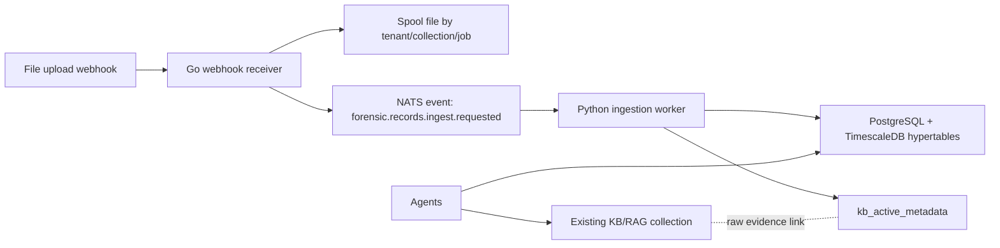

# Forensic Intelligence Platform - Phase 1

Phase 1 introduces an enterprise ingestion path for structured forensic telemetry. It is additive to the existing LocalAI Knowledge Base and the current lightweight Records UI.

## Current speech provenance boundary (source-ready, 2026-08-31)

ASR transcripts are review-required model observations. Reported segment times
are preserved; a text-only response does not acquire an artificial range from
zero to recording duration. Missing/invalid timing displays as unavailable.
Roman Urdu is a secondary representation linked to its parent observation;
raw Urdu and exact identifiers remain primary. Data filters disclose when
they cover only loaded sources, not the complete workspace.

Completed audio technical inspection is not transcript readiness. Detail copy
requires completed transcript artifacts; list cards without those artifacts
invite the analyst to inspect availability. Missing/invalid duration remains
unknown; valid source `duration_ms` is converted to seconds without inventing
transcript time bounds. Fresh 2026-08-31 checks found worker ASR disabled and
scoped transcript Ask unresolved, so backend accuracy is not live STT closure.

These corrections are not deployed. TTS is not connected; future Read aloud
output must be disclosed as generated accessibility audio, never source truth.
The current demo boundary is in the repository's
`docs/demo/nexusai-team-lead-multimodal-demo-v3.md`.

## Architecture Decision

The existing Knowledge Base remains the RAG/evidence layer. It is good for source lookup, semantic retrieval, and contextual grounding, but it is not sufficient for exact analytical questions over millions of rows.

The enterprise Records pipeline adds a deterministic structured store:



Use this mental model:

- **Knowledge Base/RAG**: finds evidence and context.
- **Records/TimescaleDB**: computes exact facts.
- **Agents**: decide which tool to use and synthesize cited answers.

## Reference CDR Schema

The attached `923461678183.csv` sample has 3,931 data rows and these columns:

- `MSISDN`
- `call_org_num`
- `CALL_DIALED_NUM`
- `IMSI`
- `IMEI`
- `CALL_START_DT_TM`
- `CALL_END_DT_TM`
- `INBOUND_OUTBOUND_IND`
- `Call_Network_Volume`
- `Lac_Id`
- `Site_Id`
- `Cell_SITE_ID`
- `lat`
- `longitude`
- `CALL_TYPE`
- `location`

Validated profile:

- Rows: `3931`
- Timestamp range: `2026-04-02 01:22:34` to `2026-06-20 19:08:01`
- Call types: `GPRS=3410`, `SMS=341`, `VOLTE=140`, `CALL=40`
- Directions: `DATA=3410`, `INCOMING=404`, `OUTGOING=117`
- Unique targets: `37`
- Unique locations: `34`
- Exact duplicate raw rows: `297`

## Phase 1 Components

| Path | Purpose |
| --- | --- |
| `db/forensic_records/001_phase1_records.sql` | TimescaleDB schema, hypertable, indexes, RLS, metadata, audit tables |
| `db/forensic_records/003_phase2_kb_assets_and_entities.sql` | KB asset registry, generic structured records table, cross-record entity index |
| `api/forensic_records/` | Go webhook receiver; streams upload to spool; publishes NATS job |
| `ingestion/forensic_records/` | Python worker; validates schema; routes adapters; streams rows through PostgreSQL `COPY` |
| `docker-compose.forensic-records.yaml` | Local Phase 1 stack: TimescaleDB, NATS, webhook API, worker |

The compose stack includes a one-shot `forensic-spool-init` service. It prepares the shared spool volume for the non-root API and worker containers, so uploads can be written safely without running long-lived services as root.

## Running Phase 1 Locally

Start the enterprise ingestion stack:

```powershell
docker compose -f docker-compose.forensic-records.yaml up --build
```

By default the forensic webhook also tries to mirror uploaded files into the existing LocalAI Knowledge Base endpoint at `http://host.docker.internal:8080`. If LocalAI auth is enabled, set `LOCALAI_API_KEY` before starting compose:

```powershell
$env:LOCALAI_API_KEY="your-localai-api-key"
docker compose -f docker-compose.forensic-records.yaml up --build -d
```

If you want to test structured ingestion without KB mirroring, set `FORENSIC_KB_MIRROR_ENABLED=false` in `docker-compose.forensic-records.yaml`.

Upload the attached CDR sample:

```powershell
curl.exe -X POST http://localhost:8091/webhooks/records/upload `
  -F "tenant_id=default" `
  -F "collection_id=records-demo" `
  -F "record_type=cdr" `
  -F "file=@C:\Users\W S Mughal\Downloads\923461678183.csv"
```

Uploads are idempotent by default. If the same SHA-256 already exists in the same tenant/collection, the webhook returns `status=duplicate` and does not queue another batch. Use `-F "force=true"` only when a deliberate duplicate batch is required for testing.

Check metadata:

```powershell
docker compose -f docker-compose.forensic-records.yaml exec forensic-postgres `
  psql -U localrecall -d localrecall `
  -c "SELECT status, source_file, total_rows, accepted_rows, duplicate_rows, rejected_rows FROM forensic.records_ingest_jobs ORDER BY queued_at DESC LIMIT 5;"
```

Check Knowledge Base active metadata:

```powershell
docker compose -f docker-compose.forensic-records.yaml exec forensic-postgres `
  psql -U localrecall -d localrecall `
  -c "SET app.tenant_id='default'; SELECT collection_id, source_file, total_rows, inserted_rows, duplicate_rows, unique_targets_count, min_timestamp, max_timestamp FROM forensic.kb_active_metadata;"
```

Run an exact analytical query:

```powershell
docker compose -f docker-compose.forensic-records.yaml exec forensic-postgres `
  psql -U localrecall -d localrecall `
  -c "SET app.tenant_id='default'; SELECT dialed_number, total_interactions, incoming_count, outgoing_count FROM forensic.cdr_frequent_contacts ORDER BY total_interactions DESC LIMIT 10;"
```

## Accuracy Rules

- Exact counts, rankings, filters, min/max, correlations, and timelines must query structured tables.
- KB/RAG must be used for raw evidence, source lookup, and explanations.
- Agents should never answer exact analytics from retrieved KB chunks alone.

## Phase Approval Gate

Phase 1 is complete when:

- The webhook returns `202 Accepted`.
- The worker writes `completed` job status.
- `forensic.cdr_records` contains parsed rows.
- `forensic.kb_active_metadata` matches the sample profile.
- Query outputs match deterministic sample expectations.

Do not proceed to Phase 2 until Phase 1 is approved.

## Hybrid KB + Records Policy

This policy applies to all current and future record types: CDR, ANPR, IPDR, subscribers, tower locations, transactions, access logs, policy documents, case files, and generic records.

The feature should be presented as a Knowledge Base capability, with Records as the deterministic analytical execution layer behind the KB. In product terms, analysts upload everything into a KB collection; internally, unstructured files become searchable chunks and structured files are additionally normalized into typed analytical stores.

| Question type | Correct system |
| --- | --- |
| Source lookup, evidence search, summaries, policy explanations | Knowledge Base / RAG |
| Counts, filters, min/max, top N, timelines, joins, correlations | Records / SQL analytics |
| Final narrative, recommendations, analyst report | Agent using both KB and Records |

Agents must follow these routing rules:

1. If the user asks for an exact value, use Records or SQL first.
2. If the user asks for evidence, source text, policy language, or explanation, use KB/RAG.
3. If the user asks for an exact answer with proof, compute with Records and cite KB/source metadata.
4. Never infer exact totals from retrieved KB chunks.
5. Never send full raw tables to the LLM. Send only aggregated JSON, selected rows, and citations.

Future record families should be added through typed adapters:

| Record family | Key entities | Primary analytics |
| --- | --- | --- |
| CDR | MSISDN, IMSI, IMEI, cell, location | contacts, durations, movement, anomalies |
| IPDR | MSISDN, IP, port, session time | internet sessions, IP correlation |
| ANPR | plate, camera, location, timestamp | sightings, repeat routes, co-location |
| Subscriber | MSISDN, CNIC/customer, IMSI | identity lookup, ownership history |
| Tower/location | cell ID, latitude, longitude | movement, base location, tower joins |
| Transaction | account, counterparty, amount | flows, top counterparties, suspicious timing |
| Access log | IP, user, path, status | authentication/session anomalies |
| Policy/case docs | document section, clause, subject | semantic retrieval and cited summaries |

## Phase 2 KB-Centered Routing

Phase 2 makes the Knowledge Base collection the analyst-facing boundary. Every upload has a `collection_id`; the system then classifies the file and chooses the right internal execution path.

### Phase 2 completion status (2026-07-27)

Phase 2A and 2B acceptance is complete. The machine-readable matrix contains 20
of 20 versioned ready fixture contracts across structured records, text,
spreadsheets, documents, images, audio/STT, TTS, transcripts, video, captures,
databases, archives, and unknown/mixed inputs. The final isolated collection
contains 20 evidence items and 20 KB source links with zero failures or missing
assets. Its eight supported structured jobs account exactly for 59 source rows:
34 unique accepted, 6 exact duplicates, and 19 visible rejects.

The protected `records-demo-verified` collection remains at 9,250 accepted
structured rows. Its four historical KB-only source entries were reconciled,
after a verified scoped backup, into two content-addressed evidence objects while
preserving all four distinct source links. The collection now reconciles to eight
KB entries, six evidence objects, and eight KB asset/source links.

The unchanged three-round CPU baseline passes 18 of 18 chat guardrail checks,
27 of 27 deterministic query-route checks, and three 8-vector embedding runs at
1,024 dimensions. Ready fixtures do not change the truthfulness of processing
states: OCR, STT, deep document/video/capture/database/archive work remains on
explicit pending/manual routes until later vertical slices meet their own gates.

| File family | KB/RAG behavior | Structured behavior |
| --- | --- | --- |
| PDF, docs, policies, notes | chunk, embed, cite | optional metadata only |
| CDR | keep source evidence link | typed CDR hypertable + entity index |
| IPDR | keep source evidence link | generic records + IP/session entities |
| ANPR | keep source evidence link | generic records + plate/camera entities |
| Subscriber/tower/transaction/access logs | keep source evidence link | generic records + extracted entities |
| Unknown CSV/TSV | keep source evidence link | generic records with best-effort canonical fields |

The worker now has an adapter registry:

- `cdr`
- `ipdr`
- `anpr`
- `subscriber`
- `tower_location`
- `transaction`
- `access_log`
- `generic`

Every structured upload writes:

- `forensic.kb_collection_assets`: KB-facing source asset, routing decision, source hash, headers, quality report.
- `forensic.kb_active_metadata`: analytical summary for the batch.
- `forensic.cdr_records`: exact CDR analytics when the adapter is `cdr`.
- `forensic.generic_records`: exact row-preserving storage for other structured families.
- `forensic.record_entities`: normalized entity index for phone, IMSI, IMEI, cell, plate, IP, location, account, user, or generic primary/secondary entities.

Apply Phase 2 to an existing local database:

```powershell
docker compose -f docker-compose.forensic-records.yaml exec forensic-postgres `
  psql -U localrecall -d localrecall `
  -f /docker-entrypoint-initdb.d/003_phase2_kb_assets_and_entities.sql
```

Rebuild the Phase 2 API and worker:

```powershell
docker compose -f docker-compose.forensic-records.yaml up --build -d forensic-records-api forensic-records-worker
```

Check KB asset routing:

```powershell
docker compose -f docker-compose.forensic-records.yaml exec forensic-postgres `
  psql -U localrecall -d localrecall `
  -c "SELECT collection_id, source_file, detected_record_type, structured_status, rag_status, routing_decision FROM forensic.kb_collection_assets ORDER BY created_at DESC LIMIT 5;"
```

`rag_status` meanings:

- `mirrored`: raw file was uploaded into the existing LocalAI KB collection and is available for RAG search.
- `failed`: structured ingest can still complete, but KB upload failed; inspect `records_ingest_jobs.metadata`.
- `skipped`: KB mirroring was disabled.
- `pending`: reserved for future asynchronous KB mirroring.

Check cross-record entities:

```powershell
docker compose -f docker-compose.forensic-records.yaml exec forensic-postgres `
  psql -U localrecall -d localrecall `
  -c "SELECT entity_type, entity_value, observation_count, record_types FROM forensic.entity_activity_summary ORDER BY observation_count DESC LIMIT 20;"
```

## Phase 3 evidence control-plane source completion (2026-07-29)

The next additive schema has been implemented and validated in disposable
TimescaleDB/PostgreSQL only. It normalizes immutable storage references, evidence
versions, distinct source links, idempotent processing runs, append-only run
events, typed derived artifacts, and hash-chained custody events. Existing Phase
2 rows are linked rather than rewritten or deleted.

The migration includes a read-only compatibility preflight, all-or-nothing
forward transaction, relationship verification, native-ingest smoke test,
repeat-apply drift assertions, and an explicitly gated destructive rollback.
The current local registry passed preflight for 110 evidence items, 104 linked KB
assets and 41 linked jobs. The schema has not been applied to that registry;
backup and application still require separate approval. Authenticated tenant/case
binding and non-owner RLS permission tests are now implemented and isolated-test
clean: LocalAI verifies collection ownership, the sidecar rejects caller scope
switches and limits repair to administrators, and a real non-bypass database role
can access only its tenant. This security configuration is not deployed and the
migration is not applied. The next source slice also replaces job-named mutable
spool files with scoped `sha256-scope-v1` content addresses, create-only
publication, full-read hash/size re-verification, read-only receipts, integrity
quarantine, and independent worker verification from a read-only mount. Its
source tests and full disposable migration/storage acceptance pass, but it is
likewise not deployed and is not claimed as infrastructure WORM.

The final queue-lifecycle source slice is now complete and isolated-test clean.
Evidence registration and the publication outbox commit atomically; JetStream
uses file-backed work-queue retention and stable message identity; the worker
claims a database lease, retries transient failures with bounded backoff,
publishes terminal diagnostics to a bounded DLQ, commits before `AckSync`, and
turns lost acknowledgements into ack-only redeliveries. Migration 009 makes
attempts monotonic and terminal state/lineage immutable. Explicit reprocessing
is authenticated and collection-scoped, requires an idempotency key, serializes
per evidence, and creates a linked generation without erasing earlier outputs.

A disposable 001-009 TimescaleDB chain and a real disposable NATS restart test
passed, including duplicate publication, persisted unacknowledged recovery and
synchronous acknowledgement. The retained registry and services remain
unchanged. Before production activation, run the resource-heavy focused LocalAI
proxy package on CI/higher-memory hardware, verify a fresh backup, approve and
apply migrations 008/009, provision runtime grants and persistent NATS storage,
activate service authentication, then perform a targeted deployment smoke. See
`docs/design/forensic-queue-lifecycle.md` and
`reports/forensic-phase3-queue-lifecycle-completion-20260729.md`.

## Hybrid Query Router

The forensic API exposes a safe hybrid query gateway:

- `GET /query/templates`: lists supported analytical and evidence templates.
- `POST /query/hybrid`: routes a question to Records SQL, KB evidence, or both.

The router intentionally does not execute arbitrary LLM-generated SQL. It uses rule-based intent classification plus hardcoded, parameterized, read-only SQL templates for exact analytics. This protects the zero-hallucination contract: exact counts and timelines come from TimescaleDB; KB text is used for evidence and context.

Supported templates:

| Template | Purpose |
| --- | --- |
| `collection_overview` | Collection ingest, KB asset, and record-family overview |
| `frequent_contacts` | CDR frequent contacts matrix with incoming/outgoing ratio and first/last contact |
| `call_type_breakdown` | CDR event counts by call type and direction |
| `temporal_activity` | Hourly activity, nocturnal events, and non-zero duration statistics |
| `top_locations` | Most frequent CDR locations and cell sites |
| `geospatial_movement` | Chronological movement and off-peak base-location candidates |
| `anpr_sightings` | ANPR sightings by plate, camera, and location |
| `entity_activity` | Cross-record entity summary across canonical structured record families |
| `cross_family_correlation` | Exact normalized target matches, family coverage, cited source rows, and bounded related entities across eight canonical record families |
| `relationship_network` | Co-observed entities that appear in the same rows as a target |
| `entity_timeline` | Chronological timeline across canonical structured record families |
| `source_records` | Small capped set of matching source rows for audit review |
| `schema_profile` | Detected headers, normalized schemas, routing status, and quality reports |
| `data_quality` | Ingest quality, duplicate counts, rejected rows, and parser error samples |
| `evidence` | KB evidence search with raw-entry fallback |

The `template` field is optional. For raw analyst questions, the router extracts likely targets and maps the question to the safest supported template:

| Raw question | Planned template |
| --- | --- |
| `show collection status and duplicate rows` | `collection_overview` |
| `how many GPRS records are there` | `call_type_breakdown` |
| `show top locations for 923461678183` | `top_locations` |
| `where was ABC-123 seen` | `anpr_sightings` |
| `summarize evidence for ABC-123 and show related entities` | `entity_activity` + KB evidence |
| `correlate 923461678183 across record families` | `cross_family_correlation` |
| `connect ABC-123 across datasets` | `cross_family_correlation` |
| `show relationship network for ABC-123` | `relationship_network` |
| `build timeline for ABC-123` | `entity_timeline` |
| `show source rows for ABC-123` | `source_records` |
| `show detected headers and schema` | `schema_profile` |
| `show duplicate and rejected row quality` | `data_quality` |

Example frequent contacts query:

```powershell
$body = @{
  tenant_id = "default"
  collection_id = "records-demo"
  query = "show frequent contacts"
  template = "frequent_contacts"
  limit = 10
} | ConvertTo-Json -Compress

Invoke-RestMethod -Uri "http://localhost:8091/query/hybrid" `
  -Method Post `
  -ContentType "application/json" `
  -Body $body
```

Example hybrid evidence + entity query:

```powershell
$body = @{
  tenant_id = "default"
  collection_id = "records-demo"
  query = "summarize evidence for ABC-123 and show related entities"
  target = "ABC-123"
  limit = 10
  max_kb_results = 1
} | ConvertTo-Json -Compress

Invoke-RestMethod -Uri "http://localhost:8091/query/hybrid" `
  -Method Post `
  -ContentType "application/json" `
  -Body $body
```

If the current LocalAI KB vector search cannot search a mirrored CSV, the endpoint falls back to raw KB entry content and returns a warning instead of failing the whole investigation query. This preserves KB connectivity while keeping exact analytics on the structured Records path.

Example raw runtime query with no explicit template:

```powershell
$body = @{
  tenant_id = "default"
  collection_id = "records-demo"
  query = "where was ABC-123 seen"
  limit = 10
} | ConvertTo-Json -Compress

Invoke-RestMethod -Uri "http://localhost:8091/query/hybrid" `
  -Method Post `
  -ContentType "application/json" `
  -Body $body
```

Hybrid responses can optionally use a role-compatible LocalAI chat model for bounded narrative explanation. Set `FORENSIC_SYNTHESIS_MODEL` to an installed chat/instruct model and tune `FORENSIC_SYNTHESIS_TIMEOUT` as a Go duration such as `120s`. Both synthesis paths default to 120 seconds and cap configuration at 180 seconds; the LocalAI proxy and agent caller share a 405-second transport ceiling for sequential planning, execution and synthesis, with earlier parent deadlines and cancellation preserved, and any timeout or model failure safely falls back to the deterministic response. Embedding, reranking, OCR, speech, audio, vision, image, and video model names are rejected for this role. The synthesis payload includes only a capped structured-row sample and up to four retrieved KB excerpts, each capped at 1,200 characters. KB excerpts retain the request tenant and collection plus available evidence, version, source, chunk, page, time-range, and citation locators. They are treated as untrusted source text rather than prompt instructions; exact values and citation objects must still come from deterministic Records results.

## Phase 4 Deterministic Report Synthesis

The forensic API exposes:

- `POST /reports/generate`

This produces a Markdown investigation report from the same safe templates used by the hybrid query router. It is intentionally deterministic: the report contains computed aggregates, source previews, warnings, and guardrails, but no unsupported narrative claims.

Example:

```powershell
$body = @{
  tenant_id = "default"
  collection_id = "records-demo"
  target = "ABC-123"
  include_evidence = $true
} | ConvertTo-Json -Compress

Invoke-RestMethod -Uri "http://localhost:8091/reports/generate" `
  -Method Post `
  -ContentType "application/json" `
  -Body $body
```

Report sections:

- Execution header
- Executive brief
- Collection overview
- Record-family summary
- Frequent contacts
- Temporal activity
- Top locations
- Entity activity
- ANPR sightings
- Knowledge Base evidence
- Warnings

## Phase 5 Agent Tool Bridge

Agents can now use the enterprise forensic sidecar as a governed Knowledge Base capability instead of guessing from retrieved text. When enabled on an agent, LocalAI injects three read-only tools:

| Tool | Purpose |
| --- | --- |
| `forensic_query_templates` | Lists deterministic query templates and their records/KB route |
| `forensic_hybrid_query` | Routes analyst questions to exact Records SQL, KB evidence, or both |
| `forensic_generate_report` | Builds a deterministic Markdown case report from exact aggregates and KB source previews |

Agent routing rules:

1. Use `forensic_hybrid_query` for natural-language analyst questions such as `show relationship network for ABC-123`, `show duplicate and rejected row quality`, or `summarize evidence for ABC-123 and show related entities`.
2. Use `forensic_query_templates` when the agent is unsure which deterministic capability exists.
3. Use `forensic_generate_report` when the analyst asks for a case brief, report, or handoff summary.
4. Use `search_memory` / KB search for policy language, free-text context, and evidence previews.
5. Preserve forensic API warnings in the answer, especially KB vector fallback warnings.

Agent UI configuration:

1. Open `Build` -> `Agents`.
2. Create or edit an agent.
3. Enable `Knowledge Base`.
4. Enable `Forensic Records`.
5. Set `Forensic Records API URL` to the sidecar URL:

```text
http://host.docker.internal:8091
```

Use `http://localhost:8091` only when the agent process runs directly on the host rather than inside a Docker container.

6. Set `Forensic Tenant ID` to `default`.
7. Set `Forensic Collection ID` to the KB collection/case, for example `records-demo`.
8. Increase `Max Iterations` to at least `2` so the agent can call a tool and then synthesize the answer.

Environment fallback:

```powershell
$env:FORENSIC_RECORDS_API_URL="http://host.docker.internal:8091"
```

If LocalAI auth is enabled on the sidecar bridge, also set:

```powershell
$env:FORENSIC_RECORDS_API_KEY="your-token"
```

Example agent questions:

- `Show relationship network for ABC-123 in records-demo.`
- `Summarize evidence for ABC-123 and include related entities.`
- `Show duplicate and rejected row quality for this collection.`
- `Generate a forensic report for ABC-123 with evidence.`

## Phase 6 Unified KB Upload Routing

The normal Knowledge Base upload endpoint can now act as the analyst-facing evidence boundary. When configured, `POST /api/agents/collections/{collection}/upload` stores the source in the KB and forwards every valid filename to the forensic sidecar for universal evidence registration. Registration and processing are separate decisions: only formats the current records worker can parse are queued for deterministic records ingestion; every other format is preserved with an explicit pending or manual-review route.

Uploads mirrored from the forensic sidecar carry an internal `skip_forensic_records=true` multipart marker so the unified KB route does not forward the same file back to the sidecar.

This avoids a duplicate KB copy by forwarding:

- `skip_kb_mirror=true`
- `source_entry=<existing KB entry key>`

The data-driven registration catalog covers:

- CDR, IPDR, ANPR, subscriber, tower, transaction, and access-log records.
- CSV, JSON, JSONL, NDJSON, Parquet, TSV, Excel, ODS, Arrow, Feather, Avro, ORC, and XML.
- PDF, Word, PowerPoint, OpenDocument, HTML, email, Markdown, and text evidence.
- PNG/JPEG/WebP/GIF/BMP/TIFF/HEIC/RAW/SVG images.
- WAV/MP3/M4A/FLAC/OGG/AAC/Opus/WMA/AMR audio.
- MP4/MOV/MKV/AVI/WebM/MPEG/MTS video.
- STT transcript artifacts and TTS audio outputs.
- PCAP/PCAPNG/EVTX captures, SQLite/database exports, archives, and unknown binary evidence.

Current worker execution is deliberately narrower than registration. CSV, JSON/JSONL/NDJSON, Parquet, accepted TSV/XLSX, and supported raster/audio/video formats can be queued. Specialized `.log` or `.txt` inputs can be queued when their headers identify a supported record family. Media uses the unified media route; captures, databases, archives, documents, unsupported image formats, and unknown formats remain on explicit pending/manual-review routes until their adapters are accepted. This prevents binary or unsupported evidence from being misparsed as CSV.

The breadth-first media source path preserves original evidence and writes only
source-linked derived observations. Image processing always emits technical
metadata and may run opt-in FastALPR when explicit read-only local model paths
are configured; OCR remains review-required and retains raw plus formatting-only
normalized text. Audio emits ffprobe metadata but does not fabricate a transcript
without ASR. Video composes ffprobe metadata, bounded sampled frames, embedded
audio extraction, and the same optional image/ANPR processor. Authorized case
routes provide range-capable image/audio/video preview without exposing storage
paths. Runtime availability depends on deploying the media worker and its exact
dependencies; this source statement is not a runtime acceptance claim.

Header inspection is restricted to formats understood by the records worker and rejects NUL-bearing, invalid UTF-8, overlong, or excessive-column schemas. Binary formats are classified from their extension/content signature without placing arbitrary payload bytes in PostgreSQL JSONB metadata. This keeps XLSX/DOCX, media, captures, SQLite, archives, and unknown evidence registrable while preserving the raw source unchanged.

The isolated `forensic-phase2a-acceptance-20260724` acceptance run exercises all 20 declared evidence families with 21 source objects (PDF and DOCX are separate document cases). Its verified state is 21 evidence records, 21 KB asset links, 7 completed structured jobs, 20 accepted rows, 0 rejected rows, 0 duplicate rows, 0 failures, and 13 adapter-pending/manual-review items with no records batch. STT and TTS cases retain their parent evidence IDs. These results validate registration and safe routing only; they do not claim that pending OCR, STT, video, capture, database, archive, or spreadsheet adapters are implemented.

### Pakistan deployment profile

The versioned profile in `configuration/forensic_country_profiles/pakistan.json`
defines the deployment defaults and evidence-handling rules for Pakistan. Uploads
carry `jurisdiction` and `source_timezone`; the Compose default is `PK` and
`Asia/Karachi`. Explicit offsets remain authoritative, while naïve timestamps are
interpreted in the declared source timezone and converted to UTC for canonical
storage. Raw values remain in immutable source records.

The profile covers Pakistan telephone and IMSI recognition, provider-specific
14/15/16-digit device identifiers, CNIC and PK IBAN, province/series-specific
ANPR, Urdu/English and other configured local-language scripts, data protection,
chain of custody, and source maintenance. Pattern checks are quality signals:
unknown, historic, short-code, USSD, service-label, or sentinel values are
preserved and flagged rather than silently discarded.

### Pakistan structured goldens v1.1

The first Pakistan-specific structured expansion adds fixed, fully synthetic
messy-data goldens for ANPR and PKR transactions. The companion manifest is
`ingestion/forensic_records/tests/fixtures/pakistan_structured_goldens_v1.json`.
It records exact row accounting and field expectations so a parser change cannot
silently alter accepted, rejected, or duplicate results.

- ANPR: 10 rows produce 6 valid normalized observations, including 1 exact
  duplicate, so 5 unique rows are insertable; 4 rows are visibly rejected for
  an invalid timestamp, invalid confidence, invalid coordinate, or missing plate.
  Raw Urdu/Latin text is preserved separately from a Unicode-normalized search
  key. Confidence, script, camera, province/rule version and crop-hash review
  remain explicit metadata. Plate patterns are quality signals, not a single
  national rejection expression.
- Financial transactions: 11 rows produce 7 valid normalized observations,
  including 1 exact duplicate, so 6 unique rows are insertable; 4 rows are
  visibly rejected for malformed grouping, excess minor-unit precision, an
  invalid timestamp, or conflicting amount columns. PKR values use exact decimal
  text, accounting parentheses remain negative reversals, and Pakistan IBAN
  structure/MOD-97 results are review metadata rather than guessed corrections.

Both adapters retain the exact source row and hash, apply the row-declared or
upload-declared timezone before canonical UTC conversion, and store derived
values in `metadata.normalized_fields`. The implementation uses the existing
generic records table and therefore requires no database migration. These
fixtures are synthetic and safe to commit; authorized real evidence must remain
outside the repository and can be used only to derive shape-preserving cases.

### Deterministic evidence metadata v1.5

The first Phase 2B media slice runs during evidence registration without an OCR,
speech, or vision model. It stores versioned `media_metadata` on the evidence:

- PNG, JPEG and GIF: bounded header decoding, detected format, width, height,
  pixel count, and an explicit decode-review flag above 100 million pixels.
- BMP: bounded file/DIB header validation, dimensions, bit depth, compression
  code, and top-down row orientation.
- TIFF: bounded primary-IFD parsing with a 512-entry ceiling, dimensions, and
  orientation. JPEG EXIF parsing reads only orientation from the bounded APP1
  header; GPS, camera identity, timestamps, comments, and other free text are
  intentionally not retained by this extractor.
- WebP: bounded RIFF/chunk validation, canvas dimensions, animation, alpha,
  EXIF, XMP, and ICC-presence flags. Embedded metadata payloads are not copied.
- RIFF/WAVE: audio format code, channels, sample rate, byte rate, bit depth,
  audio data bytes and duration, with chunk sizes checked against the declared
  RIFF boundary.
- FLAC: the mandatory 34-byte STREAMINFO block supplies channel count, sample
  rate, bit depth, sample count, block/frame bounds, and duration when the total
  sample count is known.
- MP3: validates every MPEG audio frame header and declared frame boundary,
  MPEG version/layer, sample rate, channel mode, CRC presence, CBR/VBR bitrate
  range, exact frame/sample counts, and duration. ID3v2 header/footer boundaries
  and ID3v1 presence are recorded, but tag values and compressed audio payloads
  are not read or retained. Free-format bitrate streams currently fail closed.
- MP4/M4A/M4V/MOV/3GP: validates complete ISO Base Media box boundaries,
  including 64-bit sizes, and inventories file brands, movie/track timescales
  and durations, handler types, registered codec codes, video dimensions and
  rotation, audio channels/sample rate, and media-data byte totals. Media-data
  payloads, user metadata, compressed samples, frames, and embedded audio are
  not read or decoded.
- PDF: a bounded structural lexer inventories the declared version, page-tree
  count, visible page objects, EOF/startxref, linearization, encryption,
  embedded-file, JavaScript/action, AcroForm/XFA, signature, and object-stream
  indicators. It skips literal/hex strings and stream bodies, extracts no text,
  and never executes document actions.
- ZIP and ZIP64: the end record and central-directory bounds are preflighted
  before allocation. Inventory records member/type/extension counts, declared
  compressed and expanded sizes, maximum compression ratio, encryption,
  duplicate names, nested archives, unsafe paths, and bounded symlink targets.
- TAR: a constant-memory 512-byte header scanner validates checksums, declared
  sizes, terminal blocks, paths, links, special files, nesting, and expansion
  bounds without reading regular-file bodies.
- SQLite: raw read-only page inspection validates the 100-byte SQLite format 3
  header, page size/counts, format versions, encoding, schema cookie/format,
  freelist declarations, application/user versions, and bounded
  `sqlite_schema` B-tree records. It retains bounded object names, types, table
  associations, root pages, and exact row counts for fully traversed ordinary
  and `WITHOUT ROWID` table B-trees. It does not execute SQL or schema
  definitions, load extensions, open journal/WAL sidecars, read data values, or
  retain schema SQL text.
- PCAP: validates classic little/big-endian microsecond and nanosecond headers,
  version, snapshot length, link type/FCS flags, every packet-record boundary,
  captured/original byte totals, truncation, timestamp order, and UTC bounds.
- PCAPNG: validates every leading/trailing block length, per-section byte order
  and declared length, interfaces, link types, snapshot lengths, decimal/binary
  timestamp resolution and offset, packet-to-interface references, enhanced,
  simple and obsolete packet blocks, and counts for statistics, name-resolution,
  custom, unknown, and decryption-secrets blocks. Concatenated sections may use
  different byte order.

Image signatures are compared with their filename extensions. A disagreement
keeps the immutable evidence registered and preserves the detected technical
metadata, but adds an explicit warning for investigation. The extractor caps
image-header reads at 4 MiB, media chunk/segment walks at 512 entries, and TIFF
primary IFDs at 512 entries. PDF inventory reads at most the first 64 MiB plus
the final 128 KiB and retains at most 500,000 structural tokens. Archive policy
limits inventory to 10,000 members and a 64 MiB ZIP central directory; archives
above 10 GiB declared expansion, 2 GiB per member, or 100:1 compression require
review. Nested archives, links, unsafe paths, encrypted members, duplicates, and
special files block automatic extraction. Member names are inspected in memory
but not persisted in metadata.

SQLite inspection reads at most 4,096 distinct pages or 64 MiB, whichever is
reached first; accepts at most 2,048 schema objects, 1 MiB per schema record,
8 MiB of aggregate schema payload, 512 bytes per retained object name, a B-tree
depth of 64, and bounded row counts for at most 256 tables. Page cycles,
out-of-range/reused root pages, malformed records, impossible sizes, and budget
exhaustion are rejected or surfaced as incomplete. A WAL-mode header produces
an explicit warning because an uploaded main database alone cannot prove that
separate uncheckpointed `-wal` frames were included.

Packet-capture inspection is capped at 1,000,000 packets, 1,250,000 blocks,
1,024 sections, 10,000 interfaces, 4,096 interfaces per section, 64 MiB of
header/technical-option reads, 16 MiB per captured packet, 32 MiB per PCAPNG
block, and 64 KiB of interface options. Packet payload bytes are never read.
Interface names/addresses, capture filters, name-resolution values, and
decryption-secret values are never retained. Oversized, truncated, cyclic,
misaligned, cross-interface, or inconsistent structures fail closed while the
immutable evidence remains registered with a warning.

MP3 inspection is capped at 1,000,000 frames, 4,096 bytes per declared frame,
and 8 MiB of aggregate technical-header reads. It seeks across compressed frame
payloads and reads only four-byte frame headers plus bounded ID3 signatures and
boundaries. ISO Base Media inspection is capped at 100,000 boxes, 4,096 tracks,
256 sample descriptions per track, 64 compatible brands, nesting depth 12, and
8 MiB of aggregate technical-header reads. Arbitrarily large `mdat` payloads are
accounted from validated box sizes without being read.

Corrupt or unsupported media remains registered with the immutable source hash
and an explicit warning. Metadata success does not change the higher-level route:
images remain `image_ocr_vision_pending`, audio remains `audio_stt_pending`, PDF
remains `document_extraction_pending`, archives remain `archive_inventory_pending`,
SQLite remains `database_adapter_pending`, packet captures remain
`capture_adapter_pending`, MP4/MOV remains `video_analysis_pending`, and TTS
remains a derived artifact.
This prevents technical inventory from being
mistaken for completed OCR, attachment extraction, transcription, diarization,
visual analysis, archive unpacking, recursive child registration, SQL-dump
execution, column/foreign-key extraction, selected-row normalization, protocol
decoding, endpoint extraction, or network-session reconstruction.

Extractor warnings are merged without duplicates into the immediate upload
response, the persisted evidence item, and the linked KB asset
`quality_report.warnings`. Callers therefore receive the same active-content,
attachment, unsafe-path, nesting, and expansion-risk findings at registration
time that later reviewers see in the evidence catalog.

Forwarding uses streaming multipart I/O instead of buffering the entire upload in memory. Configure the sidecar upload deadline with `FORENSIC_RECORDS_UPLOAD_TIMEOUT`; the default is `5m` for large evidence.

Enable the unified route for a LocalAI process:

```powershell
$env:FORENSIC_RECORDS_API_URL="http://host.docker.internal:8091"
$env:FORENSIC_RECORDS_KB_UPLOAD_ENABLED="true"
$env:FORENSIC_RECORDS_TENANT_ID="default"
$env:FORENSIC_RECORDS_UPLOAD_TIMEOUT="5m"
```

If the sidecar is protected:

```powershell
$env:FORENSIC_RECORDS_API_KEY="your-token"
```

For Docker, pass the same variables into the LocalAI container. The sidecar URL should be `http://host.docker.internal:8091` when LocalAI runs in Docker Desktop and the sidecar publishes port `8091` on the host.

Resulting behavior:

| Upload path | File type | Evidence registration | Processing behavior |
| --- | --- | --- | --- |
| KB collection upload | Supported structured CSV/JSON/Parquet | Registered with hash, evidence/version IDs, KB source entry, and audit event | Queued to deterministic records worker |
| KB collection upload | PDF/document/text | Registered as document/text evidence | Existing KB indexing plus document/text extraction route |
| KB collection upload | Image/audio/video | Registered with immutable source lineage | OCR/vision, STT, or video-analysis pending route; not sent to records worker |
| KB collection upload | TSV/Excel/financial workbook | Registered and record family retained when recognizable | Typed spreadsheet/delimiter adapter pending |
| KB collection upload | PCAP/database/archive/unknown | Registered and preserved | Explicit capture/database/archive/manual-review route |
| Forensic sidecar upload | Any evidence type | Registers directly and mirrors to KB when enabled | Queues only when the active adapter supports the source format |

Optional multipart lineage hints:

- `declared_modality`: caller-declared modality, validated against the supported vocabulary.
- `evidence_role=source`: default source evidence.
- `evidence_role=stt_transcript`: derived STT transcript.
- `evidence_role=tts_output`: derived TTS audio.
- `evidence_role=derived_artifact`: another derived artifact.
- `parent_evidence_id`: source evidence for a transcript, TTS output, thumbnail, OCR result, or other derivative.
- `case_id`: optional case association.

The upload response may include:

- `records_status=queued`: forwarded to sidecar successfully.
- `evidence_status=registered`: preserved as evidence without records-worker execution.
- `evidence_registration`: evidence ID, version ID, hash, modality, route, and warnings.
- `records_status=failed`: KB upload succeeded, but structured sidecar ingest failed.
- `records_warning`: warning text for sidecar forwarding failures.

## Enterprise KB Requirements

The target Knowledge Base behavior is not just document search. It must be a governed data intelligence layer that handles mixed evidence types with accuracy, speed, and clear source provenance.

Required capabilities:

- Multi-format ingestion: PDFs, docs, policies, CSV, Excel, JSON, CDR, IPDR, ANPR, subscriber files, tower dumps, transactions, access logs, and generic records.
- Automatic classification: detect whether a file is unstructured text, semi-structured evidence, or structured records.
- Typed adapters: normalize known record families into canonical schemas while keeping the original raw row.
- RAG-ready indexing: chunk documents with stable `collection_id`, `file_id`, `batch_id`, source offsets, page numbers, row ranges, and hashes.
- Exact analytics: answer counts, filters, joins, timelines, and correlations from SQL/TimescaleDB rather than vector search.
- Hybrid answers: combine SQL results with KB citations when an analyst asks for both facts and supporting evidence.
- Performance: bulk ingestion should stream files, use queues, avoid loading full datasets into memory, and expose job progress.
- Governance: tenant isolation, audit logs, PII handling, retention/deletion, source hash verification, and role-based access.
- Agent routing: agents must decide between KB search, Records SQL, or both based on the user question.

## Capability-aware answers

The Phase 4 capability endpoint reports support for every registered evidence
family in the selected collection:

```text
GET /api/records/forensic/capabilities?collection_id=<collection>
```

Each family is reported as `queryable`, `semantic_only`, `registered_pending`,
`no_data`, or `manual_review`. A query that directly requires an adapter or model
which has not passed acceptance returns `capability.status=unavailable` before
SQL, Knowledge Base retrieval, or model synthesis. Metadata, hash, inventory and
registered-evidence questions remain available where their deterministic parser
exists. This prevents a chat model from pretending it performed OCR, STT, video,
packet, archive, database, spreadsheet, or document extraction.

Records Intelligence displays the same 20-family map and offers immutable,
idempotent evidence reprocessing. Reprocessing creates a linked job generation;
it does not reset prior terminal jobs or erase outputs.

TSV streams rows, detects UTF-8/UTF-16/CP1252 and delimiter information,
preserves exact source strings, disambiguates duplicate/blank headers, and
retains overflow columns. Bounded read-only XLSX processing is also accepted in
source: it preserves sheet/row/cell lineage, raw and cached values, formula text,
hidden state, dates, errors, and merged ranges without executing workbook
content. Phase 4D classifies every non-empty worksheet independently. A unique
typed-header match is promoted to its CDR, IPDR, ANPR, subscriber,
tower/location, transaction, or access-log adapter; ambiguous and unrelated
sheets remain generic with a recorded mapping decision and review state. An
explicit typed upload still preserves non-matching worksheets rather than
silently dropping them. ODS and deeper columnar formats remain explicitly
pending.

The Records Intelligence source UI now opens as an analyst-first three-step
workflow: ask and analyze, review evidence, or manage data. The primary query
keeps collection, natural-language question, and Analyze visible; deterministic
templates, synthesis model selection, result limits, and runtime field examples
are progressively disclosed under Advanced options. Capability/evidence and
batch-management panels are closed until requested. This is the first
simplification slice; later UI work will separate analyst, evidence, ingestion,
and administration workspaces and add automated accessibility/usability gates.

Phase 4C adds `cross_family_correlation` for exact target correlation over CDR,
IPDR, ANPR, subscriber, tower/location, transaction, access-log, and generic
canonical records. It is tenant/collection scoped, supports optional date and
record-family filters, caps targets and result expansion, and returns
`evidence_id`, `version_id`, `record_id`, source file, source row/hash, timestamp,
and XLSX sheet/row locators where available. Phone punctuation is normalized
only for targets with at least eight digits; mixed letter/digit identifiers such
as plates can use an alphanumeric compact key. Substring matching is prohibited.
Displayed source rows and related-entity scans are bounded, and truncation is
reported as an explicit limitation rather than presented as exhaustive.

Phase 4E closes the structured-data v1 source boundary with a privacy-safe
offline provider audit and typed IPDR depth. `worker.py audit-source` uses the
production profiler/normalizers but emits only source hash, schema/dialect,
adapter decision, total/accepted/rejected/duplicate/overflow accounting, stable
rejection categories, UTC bounds and privacy assertions. It performs no upload,
database/queue write, DNS request or raw-identifier output. The supplied
real-format CDR CSV passes 3,931/3,931 production normalization rows with zero
rejects, 297 exact duplicates and 3,634 unique normalized rows. Typed IPDR adds
IPv4/IPv6, NAT, ports, exact non-negative bytes, session duration/order, IDNA
domain form, subscriber/session IDs and declared timezone validation.

The versioned Phase 4 structured acceptance matrix covers CDR, IPDR, ANPR,
transaction, subscriber, tower/location and access/security families; generic,
TSV and per-sheet XLSX behavior remain covered by their existing goldens. This
is a source-complete v1 boundary, not an exhaustive claim about every private
provider export. New vendor aliases and schema drift become additive compatibility
packs and cannot weaken the existing exact accounting/provenance gates.

## Versioned Family Platform Contracts

Phase 5A introduces a source-only, versioned platform catalog for family
adapters, deterministic operations, specialist-agent manifests, model roles,
typed query plans, and enterprise responses. Authenticated read-only discovery
is available in source at:

- `/api/v1/forensics/adapters`
- `/api/v1/forensics/operations`
- `/api/v1/forensics/agents`
- `/api/v1/forensics/contracts`

The current CDR and generic-tabular worker implementations are compatibility
wrapped by the registry. Their existing normalization, row accounting,
Timescale/PostgreSQL persistence, KB linkage, and provenance paths are unchanged.
The catalog declares the future case orchestrator and evidence-domain
specialists, but it labels them as contract-only, compatibility, or pending as
appropriate. It does not create additional runtime agents or claim that OCR,
ASR, vision, video, archive extraction, or database query adapters are deployed.

The `forensics.query-plan/v1` contract carries tenant, case and collection scope;
families; entities; timezone-aware time bounds; filters; measures; grouping;
sorting; limits; required tools; and clarifications. The
`forensics.enterprise-response/v1` contract keeps deterministic findings, cited
semantic evidence, inferred relationships with confidence, model interpretation,
unsupported operations, limitations, typed tables/visualizations, and execution
trace in separate fields. Existing `/query/hybrid` response JSON remains the
compatibility contract until a later bounded migration.

## Seed Lab And Large-Case Testing

Use the deterministic seed pack to test bulk ingestion, mixed record families, KB documents, hybrid query routing, and agent tool calls without waiting for real evidence files.

Generate a seed pack:

```powershell
cd D:\Projects\LocalAI
python scripts/generate_forensic_seed_data.py --out fixtures/forensic_seed/records-demo --collection records-demo --cdr-rows 5000 --anpr-rows 750 --ipdr-rows 2500 --access-rows 1000
```

The generated pack includes:

| File | Purpose |
| --- | --- |
| `seed_cdr_large.csv` | Large CDR simulation using the worker-compatible raw CDR columns |
| `seed_anpr.csv` | Plate/camera/location sightings for relationship and timeline testing |
| `seed_ipdr.csv` | Live sidecar-compatible IPDR CSV |
| `seed_ipdr.jsonl` | JSONL IPDR for validating JSONL upload support after API rebuild |
| `seed_access_log.csv` | Access log evidence |
| `policy_records_handling.md` | KB policy document for RAG/context |
| `case_notes_records_demo.txt` | KB case notes for RAG/context |

Upload the seed pack into the running sidecar and KB:

```powershell
powershell -ExecutionPolicy Bypass -File scripts/seed_forensic_records.ps1 -SeedDir fixtures/forensic_seed/records-demo -TenantId default -CollectionId records-demo
```

Verify ingest status:

```powershell
docker compose -f docker-compose.forensic-records.yaml exec forensic-postgres `
  psql -U localrecall -d localrecall `
  -c "SELECT status, source_file, record_type, total_rows, accepted_rows, duplicate_rows, rejected_rows FROM forensic.records_ingest_jobs WHERE source_file LIKE 'seed_%' ORDER BY queued_at DESC;"
```

Verify hybrid query:

```powershell
$body = @{
  tenant_id = "default"
  collection_id = "records-demo"
  query = "show collection overview data quality and record families after seed ingest"
  limit = 10
  max_kb_results = 3
} | ConvertTo-Json -Compress

Invoke-RestMethod -Uri "http://localhost:8091/query/hybrid" `
  -Method Post `
  -ContentType "application/json" `
  -Body $body
```

UI seed workflow after rebuilding the React UI into LocalAI:

1. Open `/app/records?seed_lab=1`.
2. Use `Seed Lab`.
3. Set collection to `records-demo`.
4. Set CDR rows, for example `2500` or `5000`.
5. Choose `Generate Files` to inspect the generated upload list, or `Generate + Ingest` to ingest immediately.
6. Use the query builder, aggregates, helper chips, and CSV export to validate exact analytics.

The normal presentation URL `/app/records` hides the seed controls. Use it for demos and team reviews.

Agent validation after seed ingest:

1. Open `Build` -> `Agents`.
2. Enable `Knowledge Base`.
3. Enable `Forensic Records`.
4. Set `Forensic Records API URL` to `http://host.docker.internal:8091` for Docker-hosted LocalAI, or `http://localhost:8091` for host-run LocalAI.
5. Set `Forensic Tenant ID` to `default`.
6. Set `Forensic Collection ID` to `records-demo`.
7. Ask:

```text
Show relationship network and timeline for ABC-123 using seeded ANPR and KB notes.
```

```text
Show data quality, duplicate rows, rejected rows, and record families for records-demo.
```

```text
Generate a forensic report for ABC-123 with evidence.
```
