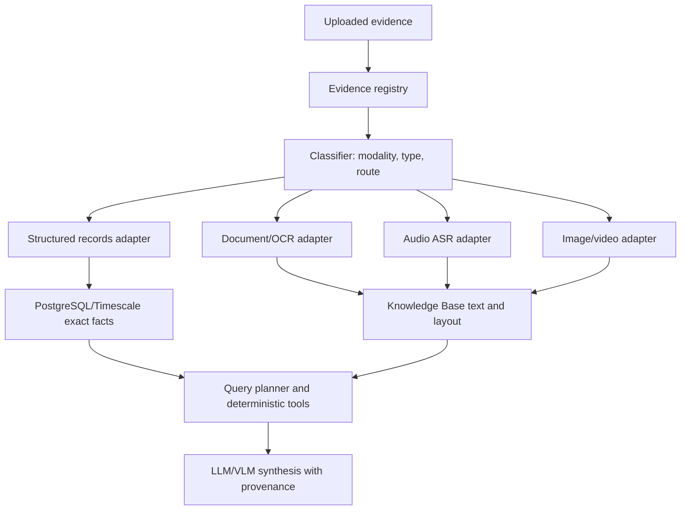

+++
title = "Forensic Model Benchmarking"
weight = 46
+++

Forensic Model Benchmarking gives NexusAI / LocalAI a data-driven way to choose models and backends for each evidence type without hardcoding one global model.

The rule is simple: deterministic evidence processing is the source of truth, and models are selected per evidence route for extraction, retrieval, routing, transcription, OCR correction, visual understanding, and final analyst synthesis.

{}
Do not silently download large models on an analyst workstation. Generate a plan first, check disk/GPU/RAM fit, then approve each installation.
{}

## Architecture

The model layer sits under the unified evidence registry:

1. Register every upload as an evidence item with hash, source file, detected modality, detected type, route, status, and provenance.
2. Route structured records to the forensic records worker and PostgreSQL/TimescaleDB.
3. Route text, OCR, transcripts, and previews into the Knowledge Base.
4. Route media through specialist adapters before using any general LLM/VLM answer.
5. Benchmark candidate models against fixed case fixtures before changing defaults.



## Catalog

The catalog lives at `configuration/forensic_evidence_model_catalog.json`.

It defines evidence families, recommended candidates, LocalAI gallery IDs where available, backend names, model roles, hardware profiles, benchmark tasks, and source links. Runtime behavior should read installed models and configured agent settings; it should not hardcode these recommendations.

Use the catalog planner:

```powershell
powershell -ExecutionPolicy Bypass -File scripts\forensic_model_catalog.ps1 `
  -LocalAIUrl http://localhost:8080 `
  -Profile balanced `
  -Action plan
```

Check what is already installed:

```powershell
powershell -ExecutionPolicy Bypass -File scripts\forensic_model_catalog.ps1 `
  -LocalAIUrl http://localhost:8080 `
  -Profile balanced `
  -Action status
```

Install only after review. The script asks before each model download unless `-AssumeYes` is passed:

```powershell
powershell -ExecutionPolicy Bypass -File scripts\forensic_model_catalog.ps1 `
  -LocalAIUrl http://localhost:8080 `
  -EvidenceType audio_speech `
  -Profile balanced `
  -Action install
```

## Benchmark

Run the benchmark after LocalAI and the forensic records sidecar are up:

```powershell
python scripts\benchmark_forensic_models.py `
  --localai-url http://localhost:8080 `
  --forensic-url http://localhost:8091 `
  --collection-id records-demo `
  --profile balanced `
  --output reports\forensic-model-benchmark.json
```

Add model endpoint checks when the model is installed:

```powershell
python scripts\benchmark_forensic_models.py `
  --chat-model qwen_qwen3-4b-instruct-2507 `
  --embedding-model bge-m3-colbert `
  --output reports\forensic-model-benchmark.json
```

The report records:

- LocalAI model availability
- forensic sidecar health
- deterministic query template routing
- optional chat latency and grounding checks
- optional embedding latency and vector dimensions
- catalog recommendations for the selected hardware profile

## Modality Acceptance Matrix

The machine-readable acceptance contract lives at
`configuration/forensic_modality_evaluation_matrix.json`. It covers 20 required
evidence families, including CDR, IPDR, ANPR, subscriber and tower data,
financial transactions, logs, generic tabular and spreadsheet data, documents,
images/OCR, audio/STT, TTS artifacts, transcripts, video, captures, databases,
archives, and unknown or mixed evidence.

The matrix deliberately distinguishes three support levels:

- `operational`: an adapter and real fixture-backed deterministic checks exist.
- `foundation`: registration/classification exists, but part of the vertical
  slice still requires an adapter, UI, query, or benchmark gate.
- `planned`: the file is safely registered with a visible pending/manual-review
  route and is not claimed as processed.

Every profile defines formats, fixture state, the executable classifier result,
the authoritative store, deterministic and semantic operations, entities,
relationships, metrics, thresholds, failure behavior, and its next rollout gate.
The forensic API Ginkgo suite loads this JSON and fails when a required family is
missing, a ready fixture does not exist, a classifier route drifts, a metric is
undefined, or a planned format is accidentally queued to the records worker.

Phase 2 coverage is 20 of 20 real, versioned, fixture-backed profiles. The twelve
formerly planned packs are now represented by deterministic generators and exact
SHA-256, classifier, metadata, warning, abstention, and provenance expectations.
Foundation and planned support levels still describe processing depth: a ready
fixture proves registration/classification/inventory behavior, not that pending
OCR, STT, video, packet-session, archive-extraction, or database-query adapters
are operational.

The unchanged CPU baseline is recorded in
`reports/forensic-phase2-unchanged-baseline-20260727.json`. It uses the installed
`qwen_qwen3-4b-instruct-2507` chat model and `qwen3-embedding-0.6b` embedding
model for three rounds, while deterministic sidecar routing is scored fail-closed:
HTTP errors and wrong templates both count as failed routes.

## Recommended Starting Stack

For local development, start with:

- Structured records: forensic records worker plus PostgreSQL/TimescaleDB. Use `qwen_qwen3-4b-instruct-2507` only for synthesis and query clarification.
- Knowledge Base retrieval: `BAAI/bge-m3` or `bge-m3-colbert`, with `qwen3-reranker-0.6b` for reranking when available.
- Documents/OCR: Docling for parsing and layout; PaddleOCR PP-OCRv6 for OCR-heavy documents; Qwen3-VL only after OCR/table outputs are stored.
- Audio: `whisper-large-turbo` as the fast multilingual baseline; benchmark `qwen3-asr-0.6b` and `qwen3-asr-1.7b` against local accents and noisy call recordings.
- Images/video: Qwen3-VL for visual question answering, specialist backends such as RF-DETR/SAM/face adapters for detections, and Whisper/Qwen3-ASR for video audio tracks.

## Team Lead Brief

Phase 2 is complete: all 20 evidence families have executable fixture contracts,
the unchanged installed models have a reproducible baseline, and the isolated
live acceptance proves exact structured row accounting plus truthful pending
routes for unsupported deeper analysis.

The next phase is the evidence control plane: normalized versions and processing
runs, append-only custody events, immutable source retention, authenticated
tenant/case binding, reviewed RLS, idempotent retry/acknowledgement/DLQ behavior,
and typed derived artifacts. Candidate models remain unpromoted until a later
single-change evaluation beats this fixed baseline.

## Sources

- [LocalAI model gallery](https://models.localai.io)
- [PaddleOCR](https://github.com/PaddlePaddle/PaddleOCR)
- [OpenAI Whisper large-v3-turbo](https://huggingface.co/openai/whisper-large-v3-turbo)
- [OpenAI Whisper large-v3](https://huggingface.co/openai/whisper-large-v3)
- [Qwen3-ASR](https://qwen.ai/blog?id=qwen3asr)
- [Qwen3-VL documentation](https://huggingface.co/docs/transformers/main/model_doc/qwen3_vl)
- [BGE-M3](https://huggingface.co/BAAI/bge-m3)
- [Docling](https://github.com/docling-project/docling)
