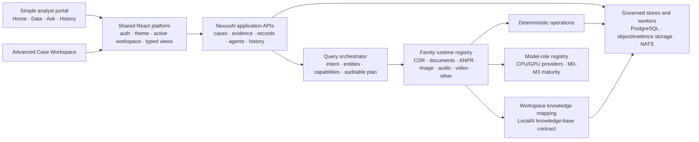

# NexusAI analyst portal product architecture

Status: authoritative product rebase and first source slice, 2026-08-17
Authority: latest team-lead directive, then `NEXUSAI_MASTER_DIRECTIVE.md`
Runtime boundary: source-only; no deployment, migration, evidence ingest, or
model promotion. One governed analysis-history row was created by the required
real CDR proof and is disclosed below.

## APF-3 orchestration decision

APF-3 architecture reconciliation is complete and implementation is not
started. The Analyst Portal will keep the existing normal-question Ask API;
NexusAI's forensic service will own typed understanding, workspace/data-aware
capability resolution, governed planning and fact/citation validation. LocalAI
remains the bounded agent/model/retrieval runtime. The detailed authoritative
record is `nexusai-apf3-unified-query-intelligence-architecture.md`.

## APF-2 runtime closure

APF-2 is live/runtime accepted on 2026-08-17 through the frontend preview and
existing backend. Source detail composes the detail response with the exact
catalog item selected by `evidence_id`; catalog `accepted_rows` is authoritative,
structured processing accounting supplies 5 input/1 duplicate/0 rejected, and
missing values render `Not available`, never zero. Citation navigation follows
the same truth rule: an explicit evidence ID wins; otherwise a citation becomes
openable only when its filename uniquely resolves to one catalog evidence item.

The single resumed query created analysis
`c540c875-0cd7-410d-bd6b-3f2be87b0336`, routed to deterministic
`cdr.temporal_activity`, returned 4 exact results and cited the retained source
at rows 5 and 2. History and source reopening pass; Continue in Ask was not
submitted. APF-3 is the reconciled next slice but has not started.

## Decision record

NexusAI now has two deliberate product surfaces over one governed backend:

- `/analyst` is the default, simple ordinary-analyst product. Its primary
  navigation is Home, Data, Ask NexusAI, and History.
- `/app/cases/...` remains the advanced Case Workspace for investigators and
  administrators who need the full evidence, relationship, job, model, and
  operational controls.

The first slice uses a separate shell and route tree in the existing React
package. This is an intentional deployment boundary, not an accidental UI
alias: it avoids a second build pipeline while reusing authentication, visual
tokens, the authoritative workspace registry, evidence APIs, agent lifecycle,
typed results, citations, and history. A later package split is justified only
if independent release cadence or isolation becomes a measured requirement.

The directive is interpreted as follows:

| Kind | Controlling interpretation |
| --- | --- |
| Desired outcome | An ordinary analyst can open one authorized workspace, understand readiness, ask a natural-language question, inspect a cited answer, and revisit history without learning agents, models, adapters, jobs, or collections. |
| Hard constraint | Preserve accepted R0-R7 work, deterministic authority, citations, custody, case/collection scope, security, and all approval boundaries. Never invent browser scope or fake an unavailable capability. |
| Architecture direction | Build a shared evidence and knowledge fabric, capability-driven orchestration, family runtime contracts, and configuration-driven model roles. |
| Sequencing direction | Prove the simple shell with the already accepted CDR vertical first; add upload, document/RAG, unified orchestration, and media families as bounded slices. |
| Non-blocking research | Preserve R8 ANPR artifacts and rejection evidence, but pause CCPD/model research during the portal foundation. Do not resume, delete, promote, or represent it as accepted. |
| Design suggestion | A standalone frontend package or BFF remains optional. Reuse current APIs until a measured contract gap warrants either boundary. |

## Verified current state and preservation

Read-only source and live-API inspection found one selectable default workspace,
`nexusai-forensic-demo`, with 10 registered evidence items, 9 ready sources,
1 failed source, 9 knowledge assets, 14 knowledge entries, 9,274 canonical
records, 6 active specialist agents, and 10 jobs (9 complete, 1 dead-letter).
The populated families include 5,004 CDR, 2,500 IPDR, 1,000 access, 750 ANPR,
11 subscriber, 5 tower, and 4 transaction records. Existing governed analysis
history is available.

Disposition of inherited work:

- R0-R7: accepted/source-accepted history remains frozen and reusable.
- Case Workspace: valid and retained as the advanced product surface.
- Structured adapters, 65 deterministic operations, agent lifecycle, evidence
  custody, typed presentation, citations, and history: reused, not forked.
- R8 research: `valid_but_paused_non_blocking`. T2-V results, the stopped CCPD
  partial, model packages, receipts, and rejection evidence remain preserved.
- New analyst portal: source accepted only after the tests recorded below. The
  running deployed UI is unchanged until a separately approved activation.

The Docker inventory could not be re-read from this sandbox, so this decision
does not claim a new container-identity verification. Live HTTP APIs and the
source preview were inspected directly.

## Target architecture



Product-specific classification, scope enforcement, cross-family planning, and
auditing remain server-side/reusable. React presents those decisions; it must
not become their only implementation.

## Analyst information architecture and workspace contract

| Route | Ordinary-user task | First-slice state |
| --- | --- | --- |
| `/analyst/home` | See workspace readiness, available intelligence, and recent analyses | Implemented with real APIs |
| `/analyst/data` | See sources and open human-readable evidence details | Implemented read-only; upload is the next slice |
| `/analyst/ask` | Ask one natural-language question and receive a typed, cited answer | Implemented by reusing governed agent SSE/lifecycle |
| `/analyst/history` | Reopen prior questions, answers, and sources | Implemented with governed server history |

`/` and a successful login enter `/analyst`. The advanced workspace remains
reachable only from the account menu when the authenticated role is an admin.
Mobile uses the same four destinations as a bottom navigation bar.

“Workspace” is the user-facing name for one server-authoritative case scope.
The selected entry is resolved from `GET /api/v1/forensics/cases`; its `case_id`
and `collection_id` travel together to records, evidence, agent, history, and
citation requests. URL scope must match the authenticated registry entry. The
browser may preserve a valid selection but may not manufacture a default,
collection, tenant, or authorization decision.

## Unified data and knowledge fabric

All inputs follow one visible lifecycle while keeping family semantics:

```text
authorized workspace -> immutable evidence registration -> validation and
classification -> ready | processing | needs attention | failed -> family
adapter or document extraction -> canonical records and/or cited passages ->
capability registry -> query and history
```

Classification uses content evidence and may return multiple candidates,
confidence, reasons, hostile-input findings, or `unknown/manual_review`; file
extension alone is never authoritative. Raw evidence, derived artifacts,
canonical records, warnings, and custody references remain traceable.

Structured data is queried through typed schemas and deterministic operations;
it is not converted into prose merely to imitate RAG. Documents use the existing
LocalAI knowledge-base and retrieval contracts, with workspace mapping and
passage-level citations. No second vector store is introduced. A lower-level
store is warranted only if the shared contract cannot meet measured isolation,
retrieval, provenance, or scale requirements.

## Query orchestration and family runtime contract

The accepted CDR path currently resolves governed variants to deterministic
operations and falls back safely when synthesis violates forensic policy. The
target reusable understanding result is structured, not a single label:

```text
intent, primary_family, supporting_families, entities, time/range constraints,
requested capability, ambiguity, confidence, missing inputs, candidate plans
```

Resolution order is explicit command, exact deterministic operation, governed
variant, capability match, retrieval, clarification/abstention, then a bounded
multi-family plan. Unrestricted LLM SQL is prohibited. Each plan records scope,
selected capabilities, inputs, operations, sources, timings, failures, and
model-role/maturity so the response compiler can produce one typed answer.

Every family runtime exposes: family and schema versions; supported evidence
types; validation/classification signals; entity and relation vocabulary;
deterministic operations; retrieval support; specialist capability names;
presentation types; citation strategy; model roles; maturity; abstention and
manual-review states; resource profile; and cross-family join keys. Specialists
request capabilities, not hardwired model names.

Relationships require typed endpoints, time validity, source citations,
confidence/basis, and an observation/inference label. A shared identifier or
similarity score is never silently presented as identity or proof.

## Model and hardware maturity

| Level | Meaning |
| --- | --- |
| M0 — Integration baseline | Functional enough to exercise the complete contract; accuracy and limitations measured and disclosed. |
| M1 — Engineering accepted | Reproducible validation, security, provenance, abstention, resource, and quality gates pass for source/non-production use. |
| M2 — Domain optimized | Representative domain evidence and declared domain thresholds pass without leaking holdout or weakening controls. |
| M3 — Operationally accepted | Live operational evidence, monitoring, rollback, privacy/legal, hardware, and production approval gates pass. |

Model-role configuration separates capability from provider. The same family
contract supports CPU today and qualified GPU providers later; provider changes
must not alter public APIs, specialist roles, citations, or deterministic
authority. A weaker fallback is visible through maturity and limitation data.

## API and capability reuse matrix

| Product need | Existing contract | Decision / gap |
| --- | --- | --- |
| Authentication/session | `/api/auth/status`, login/session/OIDC surfaces and existing `AuthContext` | Reuse. Registration policy remains deployment-configurable; no portal-only auth. |
| Authorized workspace list/default | `GET /api/v1/forensics/cases` | Reuse as sole browser scope authority. |
| Workspace identity/summary | `GET /api/v1/forensics/cases/{case_id}` and manifest | Reuse. |
| Source inventory/detail | case evidence list/detail APIs | Reuse; first slice is read-only. |
| Readiness/accounting | records status and case manifest | Reuse and translate to simple states without losing detail. |
| Family availability | records capabilities/families APIs | Reuse now; evolve into the full versioned family registry contract. |
| Ask/stream/cancel/retry | `Forensic_Records_Analyst` analysis plus SSE/status lifecycle | Reuse. Automatic routing hides agent/model selection. |
| Typed results/citations | existing forensic presentation and source locators | Reuse. Technical trace stays progressive disclosure. |
| History | governed analysis-history API | Reuse. |
| Upload/admission | existing evidence admission/job contracts | Reuse in slice two after verifying portal-safe validation and progress semantics. |
| Document retrieval | existing LocalAI knowledge-base/retrieval APIs | Reuse through workspace mapping; no direct vector-store coupling. |
| Unified multi-family plan | partial in current governed routing | Extend server-side after the structured query contract is versioned; do not emulate in React. |
| Portal facade/BFF | none required by first slice | Defer. Add only for measured aggregation, policy, compatibility, or performance needs. |

## Current UI disposition matrix

| Current capability | Simple portal | Advanced workspace |
| --- | --- | --- |
| Brand, theme, responsive/accessibility primitives | Reuse | Retain |
| Server-authoritative active case/collection context | Reuse as “Workspace” | Retain |
| Evidence inventory and source drawer | Simplify and reuse APIs | Retain full custody/job detail |
| Ask SSE lifecycle, typed result views, citations, stop/retry | Reuse with automatic routing | Retain advanced controls |
| Analysis history | Simplify and reuse | Retain |
| Agent, model, backend, collection, and operation selectors | Hide from ordinary users | Retain where authorized |
| Relationship graph, jobs, settings, media and reports | Not in primary navigation until task/capability gates justify them | Retain current accepted behavior |
| Raw IDs, hashes, routes, traces, model roles | Progressive disclosure only | Retain |
| Old Case Workspace as ordinary-user home | Superseded | Preserved as advanced surface |

## Family capability matrix

| Family | Current data/adapter truth | Deterministic / retrieval authority | Cross-family entities | Model maturity / next disposition |
| --- | --- | --- | --- | --- |
| CDR | Accepted 1.2 structured adapter; populated live proof | 65-operation catalog includes governed telecom operations | phone, subscriber, SIM, device, tower, time | Deterministic operational reference; portal proof implemented |
| Subscriber/tower | Accepted time-valid structured adapters | Exact validity/join logic; no RF-presence claims | subscriber, SIM/IMSI, IMEI, site/sector, provider | Operational structured foundation; preserve |
| IPDR | Populated canonical structured family | Current typed records/capabilities | IP, device, subscriber, time | Integration baseline; deepen when owned slice is active |
| Access/security | Populated structured family | Exact event/filter/count operations where registered | person/account, device, location, time | Integration baseline; later R12 vertical |
| Financial/transactions | Populated structured family | Exact arithmetic must remain deterministic | account, party, amount, instrument, time | Integration baseline; later R12 vertical |
| Documents/knowledge | Existing knowledge assets and retrieval platform | Passage retrieval with source citation; no structured-data RAG | names, phones, accounts, places, time | Next reference vertical after upload |
| ANPR | Structured ANPR data plus preserved R8 image contracts | Exact plate/time/location records; image candidates never proof | plate, vehicle candidate, camera, location, time | R8 research valid but paused; measured candidates blocked, no promotion |
| General image | Metadata/hash foundation only | Metadata and future governed detection/OCR/similarity | object/candidate, location, time | Planned R9; similarity not identity |
| Audio | Derived-artifact foundation only | Future timestamped transcript/search | speaker candidate, phrase, time | Planned R10 after approved benchmark |
| Video | Derived-artifact foundation only | Future segment/keyframe/audio orchestration | camera, object/speaker candidate, location, time | Planned R11 after image/audio foundations |
| Capture/database/archive | Inventory/future admission only | Must pass hostile-input and provenance gates | source-dependent | Planned R14; excluded from portal foundation |
| Unknown/ambiguous | Manual-review state is required | Abstain; preserve evidence and reasons | none until resolved | Always supported as an honest outcome |

## Roadmap rebase and bounded slices

The R0-R17 identifiers and accepted history are not replaced. The latest
team-lead direction creates one cross-cutting active work item, **APF — Analyst
Portal Foundation**, because the primary-user product boundary affects R2-R6
and enables later family phases. R8 remains the next family phase but is paused
and non-blocking while APF is active.

1. APF-1 — separate shell, authoritative workspace, real summaries, read-only
   Data, governed Ask, cited History, responsive/accessibility proof. **Source
   accepted by this change.**
2. APF-2 — unified upload/admission, classification ambiguity, progress,
   failure/recovery, and empty-state workflow using existing evidence/job APIs.
   **Source accepted; retained-runtime acceptance remains approval-gated.**
3. R13 reference slice — document extraction/retrieval with passage citations
   through the same workspace and response compiler.
4. Orchestration slice — versioned structured query result, capability registry,
   and bounded CDR+document hybrid plan.
5. Resume R8 family vertical only under its preserved Boundary A/B evidence and
   approval gates; then continue R9-R17 ownership in sequence.

Only one work item is active at a time. New media models, CCPD transfer, model
promotion, broad BFF work, and database migrations are outside APF-1.

## APF-1 acceptance and tests

Implemented source behavior:

- a distinct analyst shell and `/analyst` route tree;
- server-resolved workspace selection and real summary/capability/evidence data;
- simple source inventory and evidence deep links with technical disclosure;
- governed Ask without visible specialist/model selection;
- history backed by the current analysis-history API;
- default login/root entry, responsive desktop/mobile navigation, and no mobile
  horizontal overflow at 390 px.

Automated evidence on 2026-08-17:

- scoped ESLint on changed JavaScript: pass, zero errors;
- Vite production build: pass;
- Playwright portal/navigation regression set: 16/16 pass, including 4/4
  portal flows against controlled API fixtures and all retained advanced-shell
  navigation/viewport checks;
- full-tree ESLint: blocked by six pre-existing `react-hooks/rules-of-hooks`
  errors in `e2e/coverage-fixtures.js`; no baseline file was changed to hide it.

Live read-only proof against the existing backend also passed: Home displayed
9,274 records and actual source states; Data opened a real evidence detail; Ask
answered “Who did 923001110001 contact most?” with eight ranked contacts and
exact interaction counts/timestamps. Forensic policy rejected relationship
synthesis and the system visibly used the deterministic engine. This validates
the integration path, not a deployed portal release. The normal audited query
side effect is retained analysis `f7e12210-a7f2-42ed-a4ad-8144388ac72b`; no
evidence row, schema, case/collection, model, service, or deployment was changed.

## APF-UX-1 Analyst Experience V2 acceptance

APF-1 proved the two-surface architecture and real API integration. APF-UX-1
completes the bounded ordinary-analyst experience correction before upload work:

- **Shell:** Home, Data, Ask NexusAI and History remain the only primary portal
  destinations. Family modules remain backend capabilities, not navigation.
- **Home:** starts with investigation intent and Add Data/Ask actions, then shows
  real attention state, backend-derived suggested analyses, recent work and a
  compact coverage summary. It is not a dashboard or family inventory.
- **Data:** provides search plus type/date/status filters, friendly source names,
  status and dates, and a source drawer that puts useful facts first. Hashes,
  identifiers, storage and routes stay behind Technical source details.
- **Ask:** the ordinary analyst never selects a model, specialist or family.
  Suggested questions are computed from queryable families and
  `suggested_queries` returned by the capability API; React is not the authority.
- **History:** uses the governed history API and its cursor, with search,
  family/status/date filters, compact full-width rows, Load more, open detail and
  Continue in Ask. No parallel browser-only history store exists.
- **Truth boundary:** Add Data is disabled with APF-2 wording. The UI does not
  imply that upload, classification or retry exists before those contracts are
  connected.

Acceptance evidence on 2026-08-17:

- scoped ESLint: pass with zero errors;
- Vite production build: pass;
- focused portal/navigation/login Playwright suite: 21/21 pass;
- real-backend browser QA at 390, 820, 1024 and 1440 pixels: pass with no page
  overflow, clean console, keyboard account access and legible light/dark themes;
- real Home, Data/source detail, Ask, History and reopened analysis views: pass.

APF-UX-1 is source accepted, not deployed. Vite is the correct manual-review
surface while this product remains iterative; Docker rebuild is not required.
The previously reviewed guarded deployment gate remains available for a later
explicit activation decision. APF-2 is the exact next slice and must reuse the
existing evidence admission, custody and job contracts.

## APF-2 unified Data intake acceptance

APF-2 composes the already accepted evidence control plane into the permanent
ordinary-analyst Data journey. It does not introduce a second upload backend,
parallel evidence store, new queue, or browser-authoritative classifier.

| Product need | Reused authority | APF-2 behavior |
| --- | --- | --- |
| Upload and workspace scope | `POST /api/agents/collections/:name/upload` | One or many files, maximum two concurrent registrations, actual browser upload progress and per-file durable outcome |
| Retention and duplicate identity | content-addressed evidence admission and scope-local SHA-256 lookup | Original preserved first; duplicates report **Already added** and link to the existing evidence item |
| Classification | server byte sniffing, bounded inspection and evidence classifier | Browser preflight is advisory only; final type, route and status come from the server |
| Processing | transactional outbox and accepted worker state machine | `queued` and `running` map to **Processing**; partial bulk failure never hides successful registrations |
| Readiness | evidence status plus capability registry | **Ready**, **Processing**, **Needs attention**, and **Failed** remain distinct; source actions appear only for Ready sources and come from live `suggested_queries` |
| Catalog scale | case evidence `limit`/`offset`/`has_next` | First page remains shared portal state; **Load more sources** requests the next server page |
| Recovery | read-only case-bound reprocess-plan contract | Failed sources explain preservation, eligibility and required approval; APF-2 exposes no fake Retry and performs no reprocess |

Security and provenance remain backend-authoritative: authenticated case and
collection ownership is resolved server-side; the original filename is visible
without exposing a raw storage path; hash, evidence identifier and processing
route stay under technical disclosure; content bytes are never retained merely
by opening or staging the modal.

Source acceptance on 2026-08-17:

- scoped ESLint: zero errors and six warnings (three JSX-import false positives
  plus three pre-existing catch-variable warnings in `api.js`);
- Vite production build: pass, 677 modules;
- focused Analyst Portal Playwright: 9/9 pass, covering multi-file duplicate and
  partial failure, authoritative status mapping, server pagination,
  approval-gated recovery, responsive widths, keyboard access, themes and a
  clean browser console;
- real Vite/backend browser proof: 10 governed sources, 9 Ready and 1 Failed;
  Add Data and the failed-source recovery plan rendered in dark and light
  themes; no upload or retained-state mutation was performed.

APF-2 is source accepted. Its explicitly approved retained fixture is now
preserved as evidence `4320772b-febe-4af2-b9e3-92cea114da0b`, with 4 canonical
CDR rows and a valid 3-event custody chain. Runtime acceptance remains open:
modal **Open source** displayed `0 verified rows` because the detail item omits
accepted-row accounting and the modal callback supplies no catalog count. The
run stopped before Ask/History. Correct this bounded UI truth defect and resume
from the existing evidence without another upload; APF-3 must not start yet.

## Manual team-lead test

After an explicitly approved build/redeploy, or in a source preview:

1. Open `/`; confirm it lands on `/analyst/home` after any required login.
2. Confirm only Home, Data, Ask NexusAI, and History are primary destinations.
3. Confirm the workspace comes from the dropdown and Home shows real readiness
   and record totals.
4. Open Data, select a source, confirm status/evidence details and expand
   “Technical source details” only when desired.
5. Open Add Data, confirm multi-file/drop alternatives and the workspace-lock
   message. Do not click Add selected data unless retained ingestion is approved.
6. Open Ask NexusAI and ask `Who did 923001110001 contact most?`.
7. Confirm a ranked typed answer appears, no agent/model choice is required,
   deterministic-policy context is visible, and source navigation opens Data.
8. Open History and reopen the question and its citations.
9. Repeat at a 390 px viewport; confirm bottom navigation and no horizontal
   overflow. Sign in as a non-admin and confirm no advanced-workspace entry.

The exact next action is the bounded APF-2 source-detail accounting correction,
followed by continuation from the preserved evidence through Ask, citation and
History. Do not upload again. A Docker rebuild is not required; production
activation remains a separate guarded deployment decision.

## Files changed by APF-1

- Portal shell and pages: `core/http/react-ui/src/analyst/`
- Route/default-entry integration: `core/http/react-ui/src/router.jsx`,
  `core/http/react-ui/src/pages/Login.jsx`, and
  `core/http/react-ui/src/contexts/ActiveCaseContext.jsx`
- Governed Ask reuse: `core/http/react-ui/src/pages/AgentChat.jsx`
- Acceptance coverage: `core/http/react-ui/e2e/analyst-portal.spec.js` and the
  root expectation in `core/http/react-ui/e2e/navigation.spec.js`
- Architecture, roadmap, phase ledger, continuation, next-chat, information
  architecture, and team-lead brief documents named by this rebase
# NX-UX1A reconciliation — standalone Investigation Workspace (2026-08-26)

NX-1 is closed live. NX-UX1 begins as a bounded extension of the existing
React analyst portal, not a second frontend or a rewrite of forensic contracts.
The user-facing identity is **Investigation Workspace** with four primary
destinations: **Home**, **Data**, **Ask**, and **Activity**. `/analyst/history`
remains a compatibility redirect to the canonical Activity route.

The shell reuses `ActiveCaseProvider`, authentication, themes, forensic case
and evidence APIs, agent history, the governed presentation adapter, media
presentation helpers and source-detail drawers. The advanced `/app` surface,
model/backend controls and specialist implementation details remain outside the
standalone analyst information architecture.

| Existing surface | NX-UX1 decision | Reason |
|---|---|---|
| `/analyst` route boundary | Reuse | Already separates analyst work from administration |
| Home workspace summaries | Refine | Real retained state and capabilities already load; simplify language and hierarchy |
| Data list and unified detail drawer | Reuse, then refine in NX-UX1B/C | Broad family/media coverage and progressive technical detail already exist |
| AgentChat portal mode | Reuse behind Ask | Preserves request/history contracts; implementation selectors stay hidden |
| History storage contract | Reuse | Backend contract remains stable while the user-facing route becomes Activity |
| Governed presentation adapter | Reuse as the sole analyst result adapter | Preserves result-state, citation and limitation semantics |
| Advanced `/app` navigation | Keep separate | Prevents model/backend/admin concepts from leaking into the analyst workflow |
| Global runtime brand | Keep for advanced app | `/analyst/*` receives a route-scoped neutral boot/title and shell identity |

The design direction is restrained and task-first: dark/light theme continuity,
compact typography, one primary action per decision point, progressive
disclosure for provenance and technical fields, exact result-state language,
bidi isolation for evidence values, and `dir="auto"` for mixed Urdu/LTR query
entry. The first source slice changes no API, evidence, model or database
contract. NX-UX1B is responsible for deeper Data and unified-detail hierarchy;
NX-UX1C owns media-specific refinement.

# NX-UX1B/C reconciliation — Data, unified detail and media (2026-08-27)

The Data surface is now an evidence library rather than a backend-shaped table.
Its default hierarchy is evidence type, human filename, meaningful available-
finding state, size/date and readiness. Only status filters with real members
remain visible; date filtering is secondary. A wide desktop inspection surface
and full-width mobile detail preserve the same workflow: summary → real source
preview/findings → useful actions → optional Details → optional Technical
details. Empty field, quality, capability and derived-intelligence sections do
not claim permanent screen space.

Media remains one unified evidence-detail contract with modality-specific
presentation rather than separate mini-applications:

- images keep source aspect ratio and add working zoom, fit, reset and typed
  plate/face/OCR overlay controls;
- ANPR observations emphasize the real plate text, source crop, confidence and
  review state while the governed reference stays available on demand;
- face and image comparisons remain explicitly candidate/similarity results,
  never identity declarations;
- OCR is bounded to six visible observations by default without suppressing
  genuine low-confidence or unusual-script text;
- audio makes the player and machine-review status primary, pairs Urdu source
  text with Roman Urdu as a secondary reading aid, and hides processor/format
  data under Audio details;
- video gives retained source media first position, preserves completed-zero
  ANPR truth, seeks from recorded timestamps and keeps grouped detections
  distinct from tracking;
- TXT/PDF/DOCX use one document-preview/extraction treatment with truthful
  browser-rendering limits.

The source slice reuses all evidence/content, artifact, similarity, comparison,
Ask and citation contracts. It adds no eager artifact fetch, new API, model,
processor, retained mutation or database change. Read-only browser validation
used `default / nexusai-multimodal-product-acceptance`; responsive widths 390,
820, 1024 and 1440 have no horizontal overflow. The next architecture slice is
NX-UX1D Ask result presentation.

# NX-UX1D reconciliation — Ask and answer workspace (2026-08-27)

Ask now uses the stable Agent Chat request/history contract without retaining
its generic chat presentation. Inside `/analyst/*`, the visible hierarchy is
question scope → question → answer → deterministic findings/typed results →
sources → next questions → collapsed details. Workspace scope uses the human
workspace name; Data hand-offs additionally carry the evidence identifier in
the route while displaying the source filename rather than the identifier.

Suggestions continue to come from queryable capability data. The ordinary
analyst sees no model, agent, family, operation, backend, planner or raw trace
selector. Complete-zero, no-match, processing, not-processed, failed,
unavailable, unauthorized and invalid-request states retain separate language.
Video bounds are presented as source seconds. Citations prefer filename plus
page/row/source-time labels and retain existing source navigation. Model
interpretation, when present, follows deterministic facts and is explicitly
labeled; limitations and technical execution remain collapsed.

The analyst composer preserves `dir="auto"`, LTR identifier isolation and a
390 px usable submit path. Tables transform through the existing bounded mobile
detail contract and no accepted viewport overflows. System/tool streaming is
not exposed in analyst mode; advanced `/app` retains its existing observability,
history, retry and provenance behavior. No API, model, data, database or runtime
contract changed. NX-UX1E owns Activity redesign. Broader visual consolidation
is deliberately deferred: `HomeDeepRedesign=NX-UX1F` and
`AnalystDesignSystemConsolidation=NX-UX1F`.

# NX-UX1E reconciliation — Activity journal and source navigation (2026-08-27)

Activity is an investigation journal, not an administrative request log. Its
visible hierarchy is time group → analyst question → exact result state and
brief outcome → human source context → timestamp → review action. Search is
explicitly bounded to the currently loaded history page set, pagination remains
available, and only result filters with real members occupy permanent space.

Opening an Activity item reviews its stored result in place without executing
the question again. The review surface preserves the governed answer, findings,
typed table or timeline, citations and limitations. Technical execution stays
collapsed. Continue in Ask carries the question and source scope when the
stored record identifies one, while maintaining the stable Ask request/history
contract.

Governed states remain semantically separate. `results_present` reports the
stored result count; `complete_zero_results` says processing completed with no
detections; `no_match_for_filter` says no results matched the applied filter.
Processing, not processed, failed, unavailable, unauthorized and invalid
request each retain their own language and do not masquerade as empty success.

Citation labels prefer catalog filename and evidence type over identifiers.
Activity and Ask preserve only supported locators into Data: source time, page,
row and finding. Data acknowledges the citation context but does not claim an
automatic seek, page change or row selection that the current viewer contract
cannot perform. Structured, document, image/ANPR, audio and video sources share
this truthful navigation rule.

The implementation is analyst-route scoped, responsive at 390, 820, 1024 and
1440 px, direction-aware for Urdu plus LTR identifiers, keyboard accessible and
compatible with `/analyst/history`. Advanced `/app` behavior is unchanged. No
API, model, processor, retained-state or database contract changed. NX-UX1F
owns the deeper Home redesign and analyst design-system consolidation.

# NX-UX1F reconciliation — Home and shared analyst design system (2026-08-27)

Home is now an orientation surface rather than a dashboard/card wall. The
first-glance hierarchy is workspace name and evidence readiness → one strong
Ask entry → conditional processing/attention guidance → compact Data and
Activity summaries. Ready state is derived from evidence-source accounting,
not structured accepted-row totals, so media-only and document-heavy
workspaces cannot appear empty. The empty state promotes Add data; a
processing-only workspace explains that review is available before analysis.
Processing-only and attention-only workspaces make Data review primary and do
not promote Ask until at least one evidence source is ready.

Recent evidence reuses the Data modality, finding-preview and readiness
adapters. Recent Activity reuses the governed Activity result-state adapter and
human source labels. UUID-shaped identifiers are simplified only in the Home
preview; the authoritative stored question remains available in Activity.
Legacy execution notes mislabeled as stored findings are preserved but moved
under Technical details.

The shared analyst layer now defines route-scoped content widths, typography,
spacing, line, surface, radius and control-height contracts. Decorative Home
gradients, analyst shell glass, the suggestion/capability card catalogue,
duplicated readiness cards and coverage strip, and the duplicated legacy Ask
CSS block were removed. Home, Data and Activity page-title scales are aligned;
search/filter controls share a 42 px baseline; Ask uses the reading width and a
top-oriented empty state. `/app` remains isolated because all presentation
overrides are under `.analyst-portal` or `.analyst-ask-shell`.

Urdu and mixed-language content retain `dir="auto"`; exact LTR identifiers stay
isolated. Canonical validation covers all four routes at 390, 820, 1024 and
1440 px with zero page overflow. This slice changes no API, model, backend,
database or retained evidence contract. NX-UX1G is the exact next subphase;
NX-A1 remains blocked.

# NX-UX1G reconciliation — final product acceptance (2026-08-27)

NX-UX1 closes with Home, Data, Ask and Activity operating as one investigation
workspace rather than four adjacent screens. The canonical journey preserves
human workspace/evidence scope through Data -> Ask, renders governed results
and supported citations, opens the authoritative Data source, and reopens the
stored result from Activity without rerunning analysis.

Final acceptance adds three bounded presentation protections. Ask always owns
one semantic level-one heading. Planner confidence, display-row counts and
other execution metadata cannot appear in primary analyst findings; they stay
inside Technical details while advanced `/app` retains its observability.
Home preview masking protects complete UUIDs and their derived segments while
leaving independently written plates and other meaningful identifiers intact.

Read-only validation covers structured evidence, documents, images, ANPR,
candidate-only face observations, audio, video and KB retrieval in the retained
multimodal workspace. Complete-zero and filter-no-match remain separate;
unsupported opaque locators never trigger invented navigation. The four routes
pass accessibility, dark/light theme and 390/820/1024/1440 responsive checks.
No API, runtime, model, database or retained-evidence contract changed.
`NXUX1=CLOSED`; NX-A1 is the next bounded architecture phase.
